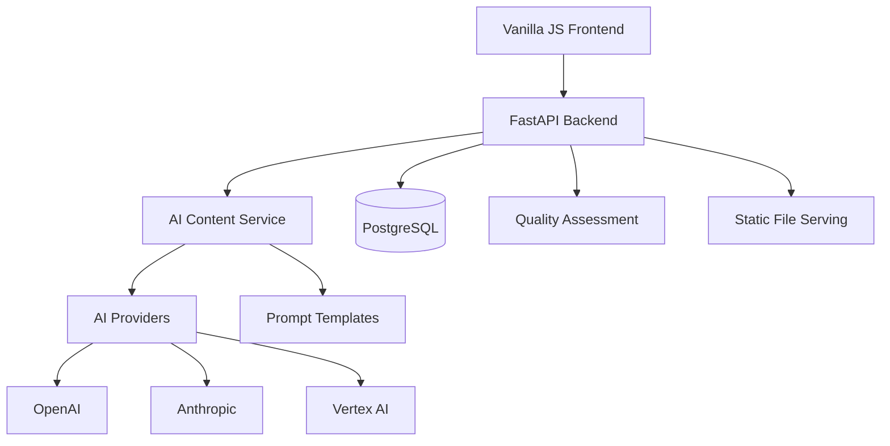

# La Factoria: Complete Project Architecture Overview

**Single Source of Truth for La Factoria Educational Content Generation Platform**

---

## 🎯 Executive Summary

La Factoria is an AI-powered educational content generation platform that transforms textual input into comprehensive educational materials. The system generates 8 different content types from a master outline, creating cohesive educational experiences.

**Architecture Philosophy**: Comprehensive implementation with extensive AI context
- **Codebase**: ~17,950 lines foundation implementation with comprehensive structure
- **Context System**: Full `.claude/` directory with all domain knowledge for optimal AI assistance
- **Implementation Status**: Foundation complete with structure established, AI integration framework in progress, quality assessment schema ready

---

## 🏗️ System Architecture

### High-Level Architecture



### Component Breakdown

#### 1. Frontend Layer (Vanilla HTML/CSS/JavaScript)
- **Purpose**: User interface for content generation requests and management
- **Technology**: HTML5, CSS3, ES6 JavaScript with FastAPI static file serving
- **Architecture**: Single-page application with client-side state management
- **Key Features**:
  - Content generation forms (8 content types)
  - Generated content display with quality metrics
  - Local API key management and storage
  - Content export functionality (copy/download)

#### 2. API Layer (FastAPI)
- **Purpose**: RESTful API for content generation and management
- **Technology**: FastAPI with Python 3.11+, Pydantic for validation
- **Key Endpoints**:
  - `POST /api/v1/generate` - Generate educational content
  - `GET /api/v1/content-types` - List available content types
  - `GET /api/v1/content/{id}` - Retrieve generated content
  - `DELETE /api/v1/user/{id}` - GDPR-compliant user deletion
  - `GET /health` - Health check and monitoring

#### 3. AI Content Service
- **Purpose**: Orchestrate AI models for educational content generation
- **Technology**: Multi-provider integration (OpenAI, Anthropic, Vertex AI)
- **Key Features**:
  - Prompt template management and formatting
  - Multi-provider failover and load balancing
  - Content quality assessment and validation
  - Token usage tracking and optimization

#### 4. Database Layer (Railway Postgres)
- **Purpose**: Persistent storage for users, content, and metadata
- **Technology**: PostgreSQL managed by Railway
- **Key Tables**:
  - `users` - User accounts and API keys
  - `educational_content` - Generated educational content with metadata
  - `quality_assessments` - Content quality assessment results
  - `api_usage` - Generation statistics and performance metrics

#### 5. Quality Assessment System
- **Purpose**: Ensure educational content meets pedagogical standards
- **Technology**: Python-based assessment algorithms
- **Quality Metrics**:
  - Educational value (≥0.75 threshold)
  - Factual accuracy (≥0.85 threshold)
  - Age appropriateness (target audience alignment)
  - Structural clarity and organization
  - Overall quality score (≥0.70 minimum)

---

## 📚 Educational Content System

### Content Types (8 Total)

1. **Master Content Outline**
   - Foundation structure with learning objectives
   - Follows Bloom's taxonomy principles
   - Provides scaffolding for other content types

2. **Podcast Script**
   - Conversational audio content with speaker notes
   - Includes timing and production guidance
   - Integrates with ElevenLabs for audio generation

3. **Study Guide**
   - Comprehensive educational material with key concepts
   - Interactive exercises and practice problems
   - Assessment questions and rubrics

4. **One-Pager Summary**
   - Concise overview with essential takeaways
   - Visual hierarchy and clear information design
   - Quick reference format

5. **Detailed Reading Material**
   - In-depth content with examples and exercises
   - Extended explanations and context
   - Progressive difficulty structure

6. **FAQ Collection**
   - Question-answer pairs covering common topics
   - Anticipates student questions and concerns
   - Supports different learning styles

7. **Flashcards**
   - Term-definition pairs for memorization and review
   - Spaced repetition optimization
   - Multiple difficulty levels

8. **Reading Guide Questions**
   - Discussion questions for comprehension
   - Critical thinking prompts
   - Group activity suggestions

### Content Generation Workflow


---

## 🤖 AI Integration Architecture

### Multi-Provider Strategy

**Primary Providers**:
- **OpenAI GPT-4**: High-quality content generation
- **Anthropic Claude**: Educational content specialization
- **Google Vertex AI**: Cost-effective scaling option

**Provider Selection Logic**:
1. Content type optimization (Claude for educational content)
2. Cost optimization (Vertex AI for bulk generation)
3. Quality requirements (GPT-4 for complex content)
4. Failover and redundancy

### Prompt Engineering System

**Template Structure**:
```
System Context + Educational Framework + Specific Instructions + Quality Requirements + Output Format
```

**Template Management**:
- Stored in `prompts/` directory
- Version controlled and tested
- Optimized for token efficiency (20-40% reduction)
- Educational standards compliance built-in

**Quality Assessment Integration**:
- Real-time content evaluation
- Multi-dimensional scoring (educational value, accuracy, appropriateness)
- Automatic regeneration for below-threshold content
- Learning feedback loop for prompt optimization

---

## 🚀 Deployment Architecture

### Railway Platform Strategy

**Infrastructure Components**:
- **Application Server**: Railway-managed container deployment
- **Database**: Railway Postgres with automatic backups
- **Domain**: Railway-provided HTTPS domain with custom domain option
- **Monitoring**: Built-in Railway metrics and logging
- **Secrets Management**: Railway environment variables

**Deployment Pipeline**:
1. Git push to main branch
2. Railway automatic build and deploy
3. Health check verification
4. Traffic routing to new version
5. Monitoring and alerting

### Environment Configuration

**Development Environment**:
- Local FastAPI development server
- SQLite for local database
- Mock AI providers for testing
- Hot reload and debugging enabled

**Production Environment**:
- Railway container deployment
- Railway Postgres database
- Full AI provider integration
- Performance monitoring and logging

---

## 🔒 Security & Compliance

### Authentication & Authorization

**API Key Authentication**:
- Bearer token-based authentication
- API keys stored securely in Railway Postgres
- Rate limiting and usage tracking
- Key rotation and revocation support

**Data Protection**:
- HTTPS enforced (Railway automatic)
- Input validation and sanitization
- No PII storage in generated content
- Secure secret management

### GDPR Compliance

**User Data Deletion**:
- `DELETE /api/v1/user/{id}` endpoint
- Cascade deletion of all user content
- Audit logging for compliance
- 30-day deletion verification

**Data Minimization**:
- No unnecessary personal data collection
- Content anonymization where possible
- Opt-in data usage policies
- Clear privacy documentation

---

## 📊 Monitoring & Analytics

### Performance Metrics

**Application Performance**:
- Response time monitoring (<200ms target)
- Error rate tracking (<1% target)
- Uptime monitoring (99%+ target)
- Resource utilization (CPU, memory, database)

**Content Generation Metrics**:
- Generation success rate
- Quality score distribution
- AI provider performance comparison
- Token usage and cost optimization

**User Experience Metrics**:
- Content type popularity
- User satisfaction scores
- Feature usage analytics
- Support request categorization

### Alerting & Incident Response

**Critical Alerts**:
- API downtime or high error rates
- Database connection failures
- AI provider service interruptions
- Quality score degradation

**Response Procedures**:
- Automated health checks and recovery
- Provider failover mechanisms
- Escalation procedures for critical issues
- Post-incident analysis and improvement

---

## 🎓 Educational Quality Framework

### Learning Science Integration

**Pedagogical Principles**:
- Bloom's taxonomy for learning objectives
- Spaced repetition for memory retention
- Multiple learning modalities support
- Progressive difficulty scaffolding

**Content Standards**:
- Age-appropriate language and complexity
- Factual accuracy verification
- Cultural sensitivity and inclusivity
- Accessibility compliance (WCAG guidelines)

### Quality Assurance Process

**Multi-Stage Validation**:
1. **AI Generation**: Content created using optimized prompts
2. **Automated Assessment**: Quality scoring algorithms
3. **Educational Review**: Pedagogical effectiveness evaluation
4. **User Feedback**: Continuous improvement through usage data

**Quality Metrics Dashboard**:
- Real-time quality score monitoring
- Content type performance comparison
- User satisfaction trends
- Educational effectiveness indicators

---

## 🔄 Development Workflow

### Code Organization

**Backend Structure**:
```
src/
├── main.py              # FastAPI application entry point
├── api/routes/          # API endpoint organization
│   ├── content_generation.py # 8 content type endpoints
│   ├── health.py        # Health check endpoints
│   ├── admin.py         # Administrative endpoints
│   └── monitoring.py    # Performance monitoring
├── core/                # Core application components
│   ├── config.py        # Configuration management
│   ├── auth.py          # API key authentication
│   └── database.py      # Database connection and operations
├── models/              # Pydantic data models
│   ├── content.py       # Content request/response models
│   └── educational.py   # Educational content models
├── services/            # Business logic layer
│   ├── educational_content_service.py # Content generation orchestration
│   ├── ai_providers.py  # AI service integration
│   ├── prompt_loader.py # Prompt template management
│   └── quality_assessor.py # Educational quality assessment
└── integrations/        # External service integrations
```

**Frontend Structure**:
```
static/
├── index.html           # Main application page (142 lines)
├── css/style.css        # Application styling
├── js/app.js           # Application logic (289 lines)
└── monitor.html         # System monitoring dashboard
```

### Testing Strategy

**Backend Testing**:
- Unit tests for all business logic
- Integration tests for AI services
- API endpoint testing with pytest
- Quality assessment algorithm validation

**Frontend Testing**:
- Component testing with React Testing Library
- Integration testing for user workflows
- E2E testing for critical paths
- Accessibility testing compliance

**Quality Assurance**:
- Pre-commit hooks for code quality
- Automated security scanning
- Performance testing and benchmarking
- Educational content validation testing

---

## 📋 Implementation Roadmap

### โ PHASE 1: FOUNDATION COMPLETE - Core Structure
1. โ FastAPI backend structure with skeletal API endpoints
2. โ Vanilla HTML/CSS/JS frontend foundation with basic interface
3. โ Service architecture framework with proper separation of concerns
4. โ Railway deployment configuration and database schema established

### ๐ง PHASE 2: FRAMEWORK IN PROGRESS - AI Integration & Quality
1. ๐ง AI provider integration framework (OpenAI, Anthropic, Vertex AI setup)
2. ๐ง Implement multi-provider failover and load balancing logic
3. ๐ง Educational quality assessment algorithms development
4. ๐ง Real-time quality validation and threshold enforcement implementation

### ๐ PHASE 3: PLANNED - Production Features
1. ๐ Railway production deployment and verification
2. ๐ Advanced monitoring and analytics dashboard
3. ๐ Batch content generation optimization
4. ๐ Performance optimization and caching

### ๐ PHASE 4: ENHANCEMENT - Advanced Features  
1. ๐ ElevenLabs audio generation integration
2. ๐ Advanced personalization and user management
3. ๐ Content versioning and iteration tracking
4. ๐ API documentation and developer tools

---

## 🎯 Success Criteria

### Technical Success Metrics
- **Response Time**: <200ms average API response
- **Uptime**: 99%+ availability
- **Quality Score**: >0.70 average for all generated content
- **Cost Efficiency**: <$0.50 per content generation

### Educational Success Metrics
- **Content Quality**: >0.75 educational value score
- **User Satisfaction**: >4.0/5.0 user rating
- **Learning Effectiveness**: Measurable learning outcomes
- **Accessibility**: WCAG 2.1 AA compliance

### Business Success Metrics
- **User Growth**: Sustainable user acquisition
- **Content Generation Volume**: Scalable content production
- **Cost Management**: Predictable operational costs
- **Market Validation**: Product-market fit indicators

---

## ๐ Current Implementation Status

### โ FOUNDATION COMPLETE (Structure Established)

#### Backend Infrastructure
- **FastAPI Application**: Backend structure with skeletal API endpoints framework
- **Database Schema**: PostgreSQL schema established with educational content models
- **Authentication System**: Basic API key-based authentication framework
- **Service Architecture**: Service layer structure with proper separation of concerns
- **Configuration Management**: Environment-based configuration framework with Railway setup
- **Health Monitoring**: Basic health check endpoints framework

#### Frontend Interface  
- **Content Generation Interface**: Basic form-based interface structure for content types
- **User Experience**: Basic local API key management and simple interaction patterns
- **Content Display**: Basic content display framework with simple formatting
- **Responsive Design**: Basic responsive interface with simple CSS styling

#### Infrastructure & Operations
- **Railway Configuration**: Basic deployment configuration established in `railway.toml`
- **Database Migrations**: Initial schema migration established with basic indexing
- **Testing Framework**: Basic test suite structure with foundational test patterns
- **Code Quality**: ~17,950 lines of structured foundation code with documentation framework

### ๐ง FRAMEWORK IN PROGRESS

#### AI Integration Layer
- **Service Architecture**: ๐ง Service structure framework (`EducationalContentService` skeleton)
- **Provider Management**: ๐ง AI provider abstraction layer framework (`AIProviderManager` structure) 
- **Prompt Integration**: ๐ง Template loading system framework (`PromptTemplateLoader` structure)
- **Multi-Provider Logic**: ๐ง Architecture designed, implementation in progress
- **Provider Failover**: ๐ง Architecture planned, implementation needed

#### Quality Assessment System
- **Assessment Framework**: ๐ง Educational quality assessor service framework
- **Quality Metrics**: โ Database schema established for quality tracking
- **Learning Science Integration**: ๐ง Framework designed, algorithms in development
- **Real-time Assessment**: ๐ง Pipeline designed, integration in progress

### โ PLANNED COMPONENTS

#### Advanced Features
- **ElevenLabs Audio Generation**: Configuration planned, integration not started
- **Batch Content Generation**: Endpoint exists, full implementation needed
- **Advanced Analytics**: Database schema ready, dashboard not implemented
- **User Management**: Basic structure exists, full user system not implemented

#### Production Enhancements
- **Railway Deployment**: Configuration complete, actual deployment not verified
- **Production Monitoring**: Basic health checks exist, comprehensive monitoring needed
- **Performance Optimization**: Caching layer planned, not implemented
- **Security Hardening**: Basic API key auth exists, comprehensive security audit needed

### ๐ Implementation Metrics

- **Total Codebase**: ~17,950 lines foundation (Python backend + HTML/CSS/JS frontend)
- **Test Coverage**: Basic test suite structure with foundational test patterns
- **API Endpoints**: Skeletal endpoint structure for 8 content types + basic admin/health
- **Database Tables**: 6 main tables established with proper relationships and indexing
- **Content Types Supported**: Framework for all 8 La Factoria educational content types
- **Deployment Readiness**: Railway configuration established, environment framework ready

---

*This architecture overview serves as the definitive reference for all La Factoria development decisions and provides comprehensive context for AI-assisted development using Claude Code.*