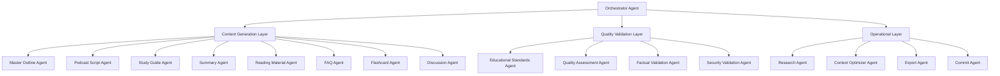

# Claude Code Agent Architecture for La Factoria

## 🏗️ System Architecture Overview

The La Factoria agent system combines Claude Code's native subagent capabilities with sophisticated multi-agent orchestration patterns to create a specialized educational content generation platform. The architecture balances advanced AI coordination with the project's simplification goals.

## 🧠 Core Architecture Principles

### 1. Hybrid Agent Model
- **Claude Code Subagents**: Specialized task-focused agents with separate contexts
- **Orchestration Framework**: Sophisticated coordination using existing .claude infrastructure
- **Educational Specialization**: Every agent optimized for educational content generation

### 2. Hierarchical Coordination
```
Orchestrator Agent (Command & Control)
    ├── Content Generation Layer (Domain Experts)
    ├── Quality Assurance Layer (Validation Specialists)  
    └── Operational Layer (Support Services)
```

### 3. Emergent Intelligence Patterns
- **Swarm Coordination**: Collective intelligence for content optimization
- **Cognitive Architecture**: Human-like reasoning for educational content
- **Adaptive Learning**: Continuous improvement based on outcomes

## 🎯 Agent Taxonomy

### **Orchestrator Agent** (Primary Coordinator)

**Role**: Master coordinator for all educational content generation workflows

**Capabilities**:
- Task decomposition and planning
- Agent coordination and resource allocation
- Quality gate enforcement
- Final content assembly and delivery

**Tools Access**: All available tools (Read, Write, Edit, MultiEdit, Bash, WebSearch, etc.)

**Context**: 
- Educational standards and frameworks
- User requirements and preferences
- Project architecture and constraints
- Quality thresholds and success metrics

**Integration Points**:
- Langfuse for prompt optimization
- Railway for deployment coordination  
- External AI providers for content generation
- Quality validation pipelines

### **Content Generation Agents** (Domain Specialists)

#### 1. Master Outline Agent
```yaml
agent_profile:
  role: "Educational Structure Architect"
  specialization: "Learning objective design and content organization"
  tools: ["Read", "Write", "WebSearch", "WebFetch"]
  context_focus: "Educational frameworks, Bloom's taxonomy, curriculum standards"
  quality_standards:
    - Logical learning progression
    - Clear learning objectives
    - Age-appropriate complexity
    - Comprehensive coverage
  integration:
    - Foundation for all other content types
    - Feeds into specialized content agents
    - Quality validation by Educational Standards Agent
```

#### 2. Podcast Script Agent
```yaml
agent_profile:
  role: "Audio Content Creator"
  specialization: "Conversational educational content with audio optimization"
  tools: ["Read", "Write", "WebSearch", "Task"]
  context_focus: "Audio scriptwriting, conversational patterns, ElevenLabs integration"
  quality_standards:
    - Natural conversational flow
    - Engaging delivery format
    - Clear pronunciation guides
    - Appropriate pacing and breaks
  integration:
    - Uses Master Outline as foundation
    - Coordinates with Audio Generation services
    - Quality validation for audio suitability
```

#### 3. Study Guide Agent
```yaml
agent_profile:
  role: "Comprehensive Learning Material Designer"
  specialization: "In-depth educational content with exercises and examples"
  tools: ["Read", "Write", "Edit", "WebSearch", "Task"]
  context_focus: "Pedagogical best practices, learning science, assessment design"
  quality_standards:
    - Comprehensive topic coverage
    - Multiple learning modalities
    - Progressive difficulty levels
    - Practice exercises included
  integration:
    - Builds from Master Outline structure
    - Coordinates with FAQ and Flashcard agents
    - Extensive quality validation
```

#### 4. Summary Agent
```yaml
agent_profile:
  role: "Concise Information Synthesizer"
  specialization: "Essential information distillation and key takeaway extraction"
  tools: ["Read", "Write", "Edit"]
  context_focus: "Information hierarchy, cognitive load theory, executive summaries"
  quality_standards:
    - Information density optimization
    - Clear hierarchy of importance
    - Actionable takeaways
    - Visual appeal and readability
  integration:
    - Synthesizes from all other content types
    - Quality validation for completeness
    - Export formatting optimization
```

#### 5. Reading Material Agent
```yaml
agent_profile:
  role: "Deep Content Developer"
  specialization: "Detailed educational content with examples, exercises, and assessments"
  tools: ["Read", "Write", "MultiEdit", "WebSearch", "Task"]
  context_focus: "Academic writing, example development, assessment design"
  quality_standards:
    - Academic rigor and depth
    - Real-world examples and applications
    - Progressive skill building
    - Assessment alignment
  integration:
    - Expands on Master Outline framework
    - Coordinates with Study Guide Agent
    - Extensive factual validation required
```

#### 6. FAQ Agent
```yaml
agent_profile:
  role: "Question-Answer Specialist"
  specialization: "Anticipating and addressing learner questions"
  tools: ["Read", "Write", "WebSearch", "Grep"]
  context_focus: "Common misconceptions, learning difficulties, question patterns"
  quality_standards:
    - Comprehensive question coverage
    - Clear, accurate answers
    - Progressive complexity
    - Cross-referenced with main content
  integration:
    - Analyzes all content types for question opportunities
    - Research Agent for question discovery
    - Quality validation for accuracy
```

#### 7. Flashcard Agent
```yaml
agent_profile:
  role: "Memory and Recall Optimizer"
  specialization: "Spaced repetition content and memory aid design"
  tools: ["Read", "Write", "Edit"]
  context_focus: "Cognitive science, memory systems, spaced repetition algorithms"
  quality_standards:
    - Optimal cognitive load
    - Memory-friendly formatting
    - Progressive difficulty
    - Effective recall triggers
  integration:
    - Extracts key concepts from all content types
    - Coordinates with Study Guide Agent
    - Quality validation for memory effectiveness
```

#### 8. Discussion Agent
```yaml
agent_profile:
  role: "Critical Thinking Facilitator"
  specialization: "Discussion questions and comprehension assessment"
  tools: ["Read", "Write", "WebSearch"]
  context_focus: "Socratic method, critical thinking frameworks, discussion facilitation"
  quality_standards:
    - Thought-provoking questions
    - Multiple perspective encouragement
    - Comprehension assessment
    - Engagement optimization
  integration:
    - Analyzes all content for discussion opportunities
    - Coordinates with Reading Material Agent
    - Quality validation for educational effectiveness
```

### **Quality & Validation Agents** (Assurance Specialists)

#### Educational Standards Agent
```yaml
agent_profile:
  role: "Educational Framework Validator"
  specialization: "Age-appropriateness, learning standards, pedagogical best practices"
  tools: ["Read", "Grep", "WebSearch", "Task"]
  context_focus: "Educational standards, age-appropriate guidelines, learning frameworks"
  validation_criteria:
    - Age-appropriate language and complexity
    - Alignment with educational standards
    - Pedagogical soundness
    - Cultural sensitivity and inclusivity
  integration:
    - Validates all content types
    - Provides improvement recommendations
    - Enforcement of quality gates
```

#### Quality Assessment Agent
```yaml
agent_profile:
  role: "Content Quality Evaluator"
  specialization: "Multi-dimensional quality scoring and improvement recommendations"
  tools: ["Read", "Write", "Grep", "Task"]
  context_focus: "Quality metrics, scoring algorithms, improvement strategies"
  assessment_dimensions:
    - Educational effectiveness (≥ 0.75)
    - Content accuracy (≥ 0.85)
    - Engagement level (≥ 0.70)
    - Technical quality (≥ 0.80)
  integration:
    - Evaluates all generated content
    - Provides quantitative quality scores
    - Triggers improvement loops when needed
```

#### Factual Validation Agent
```yaml
agent_profile:
  role: "Accuracy and Verification Specialist"
  specialization: "Fact-checking, source verification, accuracy validation"
  tools: ["Read", "WebSearch", "WebFetch", "Task"]
  context_focus: "Fact-checking methodologies, reliable sources, verification protocols"
  validation_processes:
    - Source credibility assessment
    - Cross-reference verification
    - Currency and relevance checks
    - Bias detection and mitigation
  integration:
    - Validates factual claims in all content
    - Provides source recommendations
    - Flags potential inaccuracies for review
```

#### Security Validation Agent
```yaml
agent_profile:
  role: "Safety and Security Specialist"
  specialization: "Input sanitization, content safety, privacy protection"
  tools: ["Read", "Grep", "Task"]
  context_focus: "Content safety, privacy protection, input validation"
  security_checks:
    - PII detection and removal
    - Inappropriate content filtering
    - Bias and harmful content detection
    - Privacy compliance validation
  integration:
    - Validates all inputs and outputs
    - Ensures compliance with safety standards
    - Provides security recommendations
```

### **Operational Agents** (Support Services)

#### Research Agent
```yaml
agent_profile:
  role: "Information Discovery Specialist"
  specialization: "Research, source discovery, knowledge gathering"
  tools: ["WebSearch", "WebFetch", "Read", "Task"]
  context_focus: "Research methodologies, source evaluation, knowledge synthesis"
  capabilities:
    - Multi-source research coordination
    - Source credibility evaluation
    - Knowledge gap identification
    - Research strategy optimization
  integration:
    - Supports all content generation agents
    - Provides foundational research
    - Enables fact-checking and validation
```

#### Context Optimizer Agent
```yaml
agent_profile:
  role: "Efficiency and Performance Specialist"
  specialization: "Prompt optimization, context management, token efficiency"
  tools: ["Read", "Write", "Edit", "Grep"]
  context_focus: "Prompt engineering, context optimization, performance metrics"
  optimization_targets:
    - Token efficiency (20-40% reduction)
    - Context relevance maximization
    - Response quality maintenance
    - Processing speed improvement
  integration:
    - Optimizes all agent prompts
    - Manages context hierarchies
    - Monitors performance metrics
```

#### Export Agent
```yaml
agent_profile:
  role: "Content Delivery Specialist"
  specialization: "Multi-format export, formatting optimization, delivery coordination"
  tools: ["Read", "Write", "MultiEdit", "Bash"]
  context_focus: "Export formats, formatting standards, delivery systems"
  export_capabilities:
    - JSON structured output
    - Markdown formatted content
    - HTML web-ready formats
    - Integration with external systems
  integration:
    - Handles all content delivery
    - Coordinates with backend systems
    - Manages export workflows
```

#### Commit Agent
```yaml
agent_profile:
  role: "Version Control and Documentation Specialist"
  specialization: "Git operations, documentation updates, change management"
  tools: ["Bash", "Read", "Write", "Edit"]
  context_focus: "Git workflows, documentation standards, change management"
  responsibilities:
    - Atomic commit management
    - Documentation synchronization
    - Version control best practices
    - Change impact assessment
  integration:
    - Manages all system changes
    - Maintains documentation currency
    - Coordinates with deployment systems
```

## 🔄 Agent Coordination Patterns

### 1. Hierarchical Coordination


### 2. Swarm Intelligence Coordination
```yaml
swarm_patterns:
  stigmergy:
    - Agents leave "pheromone trails" for successful content patterns
    - Trail strength indicates quality and effectiveness
    - Automatic decay prevents stagnation
    - Reinforcement amplifies successful approaches
  
  self_organization:
    - Dynamic role assignment based on content requirements
    - Spontaneous specialization for complex topics
    - Load balancing across content types
    - Emergent quality optimization patterns
  
  collective_intelligence:
    - Multi-agent content validation
    - Collaborative quality improvement
    - Distributed knowledge synthesis
    - Emergent best practice discovery
```

### 3. Cognitive Architecture Integration
```yaml
cognitive_systems:
  memory_systems:
    - Declarative: Educational standards, content templates, quality patterns
    - Procedural: Content generation workflows, validation processes
    - Episodic: Previous content generation sessions, outcome tracking
  
  reasoning_mechanisms:
    - Analogical: Applying successful patterns to new content
    - Case-based: Learning from previous content generation examples
    - Rule-based: Following educational standards and quality guidelines
  
  metacognitive_monitoring:
    - Quality assessment of agent performance
    - Strategy effectiveness evaluation
    - Continuous improvement recommendations
```

## 📊 Performance Metrics

### Agent Performance Indicators
```yaml
individual_metrics:
  content_quality:
    - Educational effectiveness score (target ≥ 0.75)
    - Factual accuracy score (target ≥ 0.85) 
    - Age appropriateness score (target ≥ 0.80)
    - Engagement level score (target ≥ 0.70)
  
  efficiency_metrics:
    - Generation time per content type
    - Token usage optimization
    - Context relevance score
    - Resource utilization
  
  coordination_metrics:
    - Inter-agent communication efficiency
    - Task completion coordination
    - Quality validation throughput
    - Error detection and correction rate
```

### System-Level Metrics
```yaml
system_performance:
  throughput:
    - Complete content set generation time (target < 5 minutes)
    - Quality validation processing time (target < 2 minutes)
    - End-to-end pipeline completion (target < 8 minutes)
  
  quality_outcomes:
    - Overall content quality score (target ≥ 0.80)
    - First-pass quality rate (target ≥ 85%)
    - Improvement iteration effectiveness
    - User satisfaction ratings
  
  reliability:
    - Agent availability (target 99%+)
    - Coordination success rate (target ≥ 95%)
    - Error recovery effectiveness
    - System fault tolerance
```

## 🔧 Technical Implementation

### Agent Creation Pattern
```yaml
agent_template:
  metadata:
    name: "[Agent Name]"
    role: "[Primary Role]"
    specialization: "[Domain Expertise]"
    version: "1.0.0"
  
  configuration:
    tools: ["list", "of", "allowed", "tools"]
    context_sources: ["relevant", "context", "files"]
    quality_thresholds: {"metric": "minimum_value"}
    integration_points: ["system", "connections"]
  
  behavior:
    system_prompt: "Specialized instructions and expertise"
    success_criteria: "Measurable outcomes"
    failure_handling: "Error recovery procedures"
    learning_patterns: "Improvement mechanisms"
```

### Coordination Protocols
```yaml
communication_patterns:
  synchronous:
    - Direct agent-to-agent messaging
    - Quality gate validation checkpoints
    - Coordination milestone reporting
  
  asynchronous:
    - Task queue management
    - Progress notification systems
    - Resource availability updates
  
  broadcast:
    - System-wide status updates
    - Quality threshold announcements
    - Emergency coordination signals
```

### Integration Framework
```yaml
system_integration:
  claude_infrastructure:
    - Leverages existing orchestration components
    - Uses established prompt optimization patterns
    - Integrates with quality validation frameworks
  
  external_services:
    - Langfuse for prompt management
    - Railway for deployment coordination
    - AI providers for content generation
    - Educational standards databases
  
  backend_coordination:
    - FastAPI endpoint integration
    - Database coordination for content storage
    - Caching layer for performance optimization
    - Export system for content delivery
```

## 🎯 Success Criteria

### Educational Effectiveness
- Learning outcome improvements demonstrated through assessments
- User engagement metrics showing increased interaction
- Content retention rates exceeding baseline measurements
- Positive feedback from educators and learners

### Technical Performance
- Sub-5-minute complete content set generation
- Quality scores consistently above 0.80
- System reliability exceeding 99% uptime
- Token efficiency improvements of 20-40%

### Operational Excellence
- Seamless integration with simplified backend architecture
- Minimal maintenance overhead (< 2 hours/month)
- Successful deployment on Railway infrastructure
- Cost-effective operation under $25/month

This agent architecture provides the foundation for La Factoria's educational content generation platform, combining sophisticated AI coordination with practical simplicity to deliver high-quality educational materials at scale.