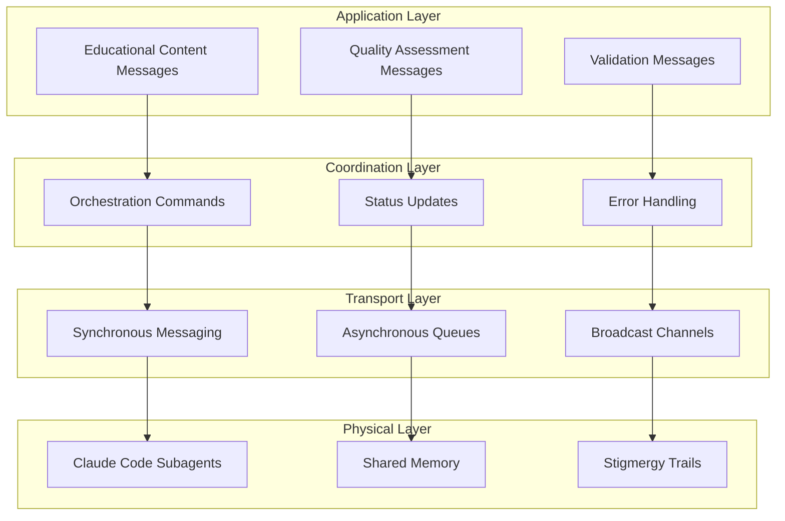

# Agent Communication Protocols for La Factoria

## 🎯 Overview

This document defines the communication protocols that enable seamless coordination between Claude Code agents in the La Factoria educational content generation system. The protocols support both synchronous and asynchronous communication patterns while maintaining educational quality and system efficiency.

## 🏗️ Communication Architecture

### Multi-Layer Communication Model



## 📡 Message Types and Protocols

### 1. Educational Content Messages

**Purpose**: Exchange educational content and metadata between specialized agents

```yaml
content_message_format:
  header:
    message_id: "unique_identifier"
    timestamp: "ISO_8601_timestamp"
    sender_agent: "agent_name"
    recipient_agent: "agent_name_or_broadcast"
    message_type: "content_exchange"
    priority: "high|medium|low"
    educational_context:
      grade_level: "target_audience"
      subject_area: "domain_focus"
      learning_objectives: ["objective_1", "objective_2"]
  
  payload:
    content_type: "outline|study_guide|podcast|summary|faq|flashcards|reading|discussion"
    content_data:
      title: "content_title"
      body: "main_content"
      metadata:
        word_count: integer
        complexity_score: float
        educational_level: string
        quality_indicators: 
          clarity: float
          accuracy: float
          engagement: float
    
    dependencies:
      requires: ["prerequisite_content_ids"]
      enables: ["subsequent_content_ids"]
      references: ["related_content_ids"]
  
  validation:
    checksum: "content_integrity_hash"
    quality_score: float
    validation_status: "pending|validated|failed"
    validators: ["validator_agent_names"]
```

**Message Flow Example**:
```yaml
content_generation_flow:
  step_1:
    from: "Master Outline Agent"
    to: "All Content Generation Agents"
    message_type: "foundation_content"
    payload: "Master outline with learning objectives"
  
  step_2:
    from: "Study Guide Agent"
    to: "Quality Assessment Agent"
    message_type: "content_validation_request"
    payload: "Generated study guide for validation"
  
  step_3:
    from: "Quality Assessment Agent"
    to: "Study Guide Agent"
    message_type: "validation_results"
    payload: "Quality scores and improvement recommendations"
  
  step_4:
    from: "Study Guide Agent"
    to: "Orchestrator Agent"
    message_type: "content_delivery"
    payload: "Validated and finalized study guide"
```

### 2. Quality Assessment Messages

**Purpose**: Communicate quality evaluations, validation results, and improvement recommendations

```yaml
quality_message_format:
  header:
    message_id: "quality_assessment_id"
    timestamp: "ISO_8601_timestamp"
    sender_agent: "validator_agent_name"
    recipient_agent: "content_generator_agent"
    message_type: "quality_assessment"
    priority: "critical|high|medium|low"
  
  assessment:
    content_id: "evaluated_content_identifier"
    quality_dimensions:
      educational_effectiveness:
        score: float  # 0.0 - 1.0
        threshold: 0.75
        status: "pass|fail|needs_improvement"
        feedback: "specific_improvement_suggestions"
      
      factual_accuracy:
        score: float  # 0.0 - 1.0
        threshold: 0.85
        status: "pass|fail|needs_improvement"
        verified_facts: integer
        flagged_claims: ["claim_1", "claim_2"]
      
      age_appropriateness:
        score: float  # 0.0 - 1.0
        threshold: 0.80
        status: "pass|fail|needs_improvement"
        language_complexity: "appropriate|too_simple|too_complex"
        cultural_sensitivity: "pass|needs_review"
      
      engagement_level:
        score: float  # 0.0 - 1.0
        threshold: 0.70
        status: "pass|fail|needs_improvement"
        interactivity: "high|medium|low"
        visual_appeal: "excellent|good|poor"
  
  recommendations:
    priority_improvements: ["improvement_1", "improvement_2"]
    optional_enhancements: ["enhancement_1", "enhancement_2"]
    validation_requirements: ["requirement_1", "requirement_2"]
  
  metadata:
    assessment_duration: "processing_time_seconds"
    confidence_level: float
    validator_expertise: "domain_relevance_score"
```

### 3. Orchestration Command Messages

**Purpose**: Coordinate agent activities, task assignments, and workflow management

```yaml
orchestration_message_format:
  header:
    message_id: "command_identifier"
    timestamp: "ISO_8601_timestamp"
    sender_agent: "orchestrator_agent"
    recipient_agent: "target_agent_or_group"
    message_type: "orchestration_command"
    priority: "urgent|high|medium|low"
  
  command:
    action: "start|stop|pause|resume|modify|query"
    task_definition:
      task_id: "unique_task_identifier"
      task_type: "content_generation|quality_validation|research|optimization"
      parameters:
        content_requirements:
          topic: "subject_matter"
          target_audience: "grade_level_or_demographic"
          content_type: "specific_format_requirements"
          quality_thresholds: "minimum_quality_requirements"
        
        resource_allocation:
          priority_level: "high|medium|low"
          deadline: "ISO_8601_timestamp"
          resource_limits: "computational_or_time_constraints"
        
        coordination_requirements:
          dependencies: ["prerequisite_tasks"]
          coordination_pattern: "hierarchical|swarm|pipeline|consensus"
          communication_frequency: "real_time|periodic|on_completion"
  
  expectations:
    deliverables: ["expected_output_1", "expected_output_2"]
    quality_requirements: "minimum_quality_standards"
    reporting_schedule: "progress_update_frequency"
    escalation_criteria: "conditions_requiring_intervention"
```

### 4. Status Update Messages

**Purpose**: Provide progress updates, health monitoring, and performance metrics

```yaml
status_message_format:
  header:
    message_id: "status_update_id"
    timestamp: "ISO_8601_timestamp"
    sender_agent: "reporting_agent"
    recipient_agent: "orchestrator_or_monitor"
    message_type: "status_update"
    priority: "routine|important|critical"
  
  status:
    agent_health:
      operational_status: "active|idle|busy|error|offline"
      resource_utilization:
        cpu_usage: float
        memory_usage: float
        context_utilization: float
      performance_metrics:
        tasks_completed: integer
        average_completion_time: float
        quality_score_average: float
        error_rate: float
    
    task_progress:
      current_task_id: "active_task_identifier"
      completion_percentage: float
      estimated_completion_time: "ISO_8601_timestamp"
      quality_indicators:
        preliminary_quality_score: float
        confidence_level: float
      
      challenges_encountered: ["challenge_1", "challenge_2"]
      resources_needed: ["resource_requirement_1", "resource_requirement_2"]
    
    coordination_status:
      active_communications: integer
      pending_validations: integer
      collaboration_effectiveness: float
      coordination_overhead: float
  
  alerts:
    performance_warnings: ["warning_1", "warning_2"]
    quality_concerns: ["concern_1", "concern_2"]
    resource_constraints: ["constraint_1", "constraint_2"]
    escalation_triggers: ["trigger_1", "trigger_2"]
```

## 🔄 Communication Patterns

### 1. Synchronous Communication Pattern

**Use Case**: Real-time coordination, immediate validation, critical decision making

```yaml
synchronous_pattern:
  characteristics:
    - Immediate response required
    - Real-time coordination necessary
    - Critical quality gate validation
    - Emergency error handling
  
  protocol:
    initiation:
      - Sender establishes direct communication channel
      - Recipient acknowledges availability
      - Communication context established
      - Priority and urgency confirmed
    
    exchange:
      - Message sent with immediate delivery requirement
      - Recipient processes message and prepares response
      - Response sent within defined time window
      - Confirmation of message receipt and understanding
    
    completion:
      - Communication outcome recorded
      - Next steps agreed upon
      - Communication channel maintained or closed
      - Results propagated to relevant agents
  
  examples:
    quality_gate_validation:
      scenario: "Content fails quality threshold"
      participants: ["Content Generator", "Quality Validator", "Orchestrator"]
      flow:
        - Content generator submits for validation
        - Quality validator immediately assesses content
        - Results communicated in real-time
        - Generator receives immediate feedback
        - Orchestrator notified of validation outcome
    
    emergency_coordination:
      scenario: "Agent failure during critical content generation"
      participants: ["Failed Agent", "Backup Agent", "Orchestrator"]
      flow:
        - Agent failure detected immediately
        - Orchestrator initiates emergency coordination
        - Backup agent activated in real-time
        - Task state transferred synchronously
        - Coordination resumed without delay
```

### 2. Asynchronous Communication Pattern

**Use Case**: Background processing, non-critical updates, batch operations

```yaml
asynchronous_pattern:
  characteristics:
    - Processing can be delayed
    - Background coordination activities
    - Batch operation coordination
    - Performance optimization communications
  
  protocol:
    message_queuing:
      - Messages placed in priority-ordered queues
      - Recipients process messages based on availability
      - Queue management ensures reliable delivery
      - Message persistence prevents loss during failures
    
    batch_processing:
      - Multiple related messages processed together
      - Efficiency optimizations through batching
      - Coordinated response to message groups
      - Reduced communication overhead
    
    eventual_consistency:
      - System state converges over time
      - Temporary inconsistencies accepted
      - Coordination effectiveness maintained
      - Performance optimized through delayed consistency
  
  examples:
    performance_optimization:
      scenario: "Context optimization across multiple agents"
      participants: ["Context Optimizer", "Content Generators"]
      flow:
        - Context optimizer analyzes usage patterns
        - Optimization recommendations queued for agents
        - Agents implement optimizations when available
        - Results reported back asynchronously
        - System-wide optimization emerges over time
    
    learning_integration:
      scenario: "Successful pattern sharing across agents"
      participants: ["High-performing Agent", "Learning System", "All Agents"]
      flow:
        - Successful patterns identified and documented
        - Learning system processes pattern for generalization
        - Optimized patterns queued for distribution
        - Agents integrate improvements when feasible
        - Collective intelligence enhanced gradually
```

### 3. Broadcast Communication Pattern

**Use Case**: System-wide announcements, emergency alerts, coordination updates

```yaml
broadcast_pattern:
  characteristics:
    - One-to-many communication
    - System-wide coordination needs
    - Emergency alert distribution
    - Policy and standard updates
  
  protocol:
    broadcast_initiation:
      - Sender determines broadcast necessity
      - Broadcast scope and priority established
      - Message prepared for wide distribution
      - Delivery confirmation mechanism activated
    
    distribution:
      - Message simultaneously sent to all relevant agents
      - Receipt confirmation collected from recipients
      - Non-responsive agents identified for follow-up
      - Message persistence ensures eventual delivery
    
    response_coordination:
      - Agent responses collected and analyzed
      - Coordination actions initiated based on responses
      - Follow-up communications sent as needed
      - System-wide coordination status monitored
  
  examples:
    quality_threshold_update:
      scenario: "Educational standards require quality threshold increase"
      participants: ["Orchestrator", "All Agents"]
      flow:
        - New quality standards identified
        - Threshold update broadcast to all agents
        - Agents acknowledge new requirements
        - Coordination patterns adjusted system-wide
        - Quality improvements implemented collectively
    
    emergency_system_alert:
      scenario: "Critical system resource constraint detected"
      participants: ["System Monitor", "All Active Agents"]
      flow:
        - Resource constraint detected and analyzed
        - Emergency conservation alert broadcast
        - Agents implement resource conservation measures
        - Coordination overhead reduced system-wide
        - Normal operations resumed when resources available
```

## 🔧 Advanced Communication Features

### 1. Stigmergy Communication

**Purpose**: Indirect coordination through environment modification (inspired by ant colonies)

```yaml
stigmergy_protocol:
  pheromone_trails:
    successful_patterns:
      - High-quality content generation approaches
      - Effective agent coordination strategies
      - Optimal resource utilization patterns
      - Educational effectiveness improvements
    
    trail_characteristics:
      strength: "Correlated with success frequency and quality"
      decay: "Automatic reduction over time to prevent stagnation"
      reinforcement: "Increased strength when patterns prove successful"
      discovery: "New agents can follow established successful paths"
  
  environment_modification:
    shared_knowledge_space:
      - Successful content templates and patterns
      - Quality improvement strategies
      - Educational effectiveness techniques
      - Agent coordination best practices
    
    collective_learning:
      - Pattern recognition across agent activities
      - Emergent best practice identification
      - Continuous system improvement
      - Adaptive coordination evolution
  
  implementation:
    trail_creation:
      - Agents mark successful approaches in shared space
      - Quality scores and effectiveness metrics attached
      - Pattern generalization for broader applicability
      - Integration with existing knowledge base
    
    trail_following:
      - New tasks leverage existing successful patterns
      - Agents adapt proven approaches to current context
      - Reduced learning curve for new coordination scenarios
      - Continuous refinement of successful approaches
```

### 2. Context-Aware Communication

**Purpose**: Optimize communication efficiency through intelligent context management

```yaml
context_optimization:
  adaptive_context:
    content_context:
      - Educational domain and subject matter
      - Target audience and learning objectives
      - Quality requirements and constraints
      - Integration with existing content
    
    agent_context:
      - Agent specialization and expertise
      - Current workload and availability
      - Performance history and capabilities
      - Communication preferences and patterns
    
    system_context:
      - Resource availability and constraints
      - Quality thresholds and requirements
      - Coordination patterns in use
      - System performance metrics
  
  intelligent_routing:
    context_matching:
      - Messages routed based on content relevance
      - Agent expertise matched to communication needs
      - Priority routing for critical communications
      - Load balancing for optimal performance
    
    compression_optimization:
      - Context-aware message compression
      - Redundant information elimination
      - Efficient encoding for specialized domains
      - Bandwidth optimization for large content transfers
  
  adaptive_protocols:
    dynamic_adjustment:
      - Communication frequency adapted to task urgency
      - Protocol selection based on coordination requirements
      - Automatic escalation for quality threshold failures
      - Performance optimization through protocol evolution
```

### 3. Multi-Modal Communication

**Purpose**: Support diverse communication needs through multiple modalities

```yaml
multi_modal_support:
  structured_data:
    formats: ["JSON", "YAML", "XML"]
    use_cases: ["Configuration", "Metadata", "Structured Content"]
    optimization: "Schema validation and compression"
  
  natural_language:
    formats: ["Markdown", "Plain Text", "Educational Content"]
    use_cases: ["Content Exchange", "Quality Feedback", "Documentation"]
    optimization: "Context-aware language models"
  
  binary_data:
    formats: ["Images", "Audio", "Compressed Content"]
    use_cases: ["Educational Media", "Performance Data", "Large Content"]
    optimization: "Efficient encoding and streaming"
  
  hybrid_communication:
    structured_metadata: "Message headers and control information"
    natural_content: "Educational content and feedback"
    binary_attachments: "Supporting media and compressed data"
    unified_processing: "Intelligent handling across modalities"
```

## 📊 Communication Performance Metrics

### Efficiency Metrics

```yaml
efficiency_measurement:
  latency_metrics:
    synchronous_communication:
      target: "< 100ms for critical coordination"
      measurement: "Round-trip time for immediate responses"
    
    asynchronous_communication:
      target: "< 5 seconds for queue processing"
      measurement: "Time from queue entry to processing initiation"
    
    broadcast_communication:
      target: "< 200ms for system-wide distribution"
      measurement: "Time for message to reach all recipients"
  
  throughput_metrics:
    message_processing:
      target: "> 1000 messages per minute"
      measurement: "Total system message processing capacity"
    
    content_transfer:
      target: "> 10MB per second for large content"
      measurement: "Educational content transfer throughput"
    
    coordination_efficiency:
      target: "< 10% overhead for coordination communications"
      measurement: "Coordination time vs. productive work time"
  
  reliability_metrics:
    message_delivery:
      target: "> 99.9% successful delivery rate"
      measurement: "Messages delivered vs. messages sent"
    
    communication_availability:
      target: "> 99.5% communication system uptime"
      measurement: "Time communication system is fully operational"
    
    error_recovery:
      target: "< 1 second for automatic error recovery"
      measurement: "Time to recover from communication failures"
```

### Quality Metrics

```yaml
quality_measurement:
  communication_accuracy:
    message_integrity:
      target: "100% message content accuracy"
      measurement: "Checksum validation and content verification"
    
    context_preservation:
      target: "> 95% context accuracy in transfers"
      measurement: "Educational context maintained across communications"
  
  coordination_effectiveness:
    task_coordination:
      target: "> 90% successful task coordination"
      measurement: "Tasks completed successfully through coordination"
    
    quality_improvement:
      target: "> 15% quality improvement through communication"
      measurement: "Content quality enhancement via agent coordination"
  
  learning_integration:
    knowledge_transfer:
      target: "> 80% successful pattern propagation"
      measurement: "Successful adoption of communicated best practices"
    
    system_evolution:
      target: "Measurable improvement in < 1 week"
      measurement: "Communication pattern optimization over time"
```

This communication protocol system enables sophisticated coordination between agents while maintaining efficiency and educational quality standards essential for La Factoria's mission.