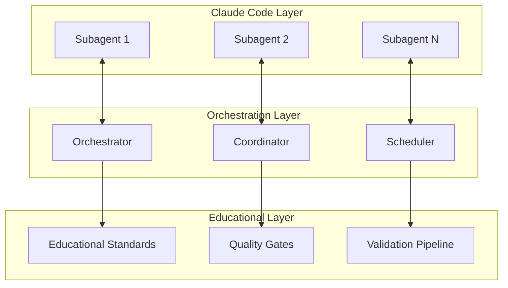

# Agent Coordination Patterns for La Factoria

## 🎯 Overview

This document details the sophisticated coordination patterns used to orchestrate multiple Claude Code agents for educational content generation. The patterns leverage both Claude Code's native subagent capabilities and La Factoria's existing advanced orchestration infrastructure.

## 🏗️ Coordination Architecture

### Hybrid Coordination Model

La Factoria employs a hybrid coordination model that combines:

1. **Claude Code Subagents**: Native task-specific agents with isolated contexts
2. **Advanced Orchestration**: Sophisticated coordination using existing .claude infrastructure  
3. **Educational Specialization**: Domain-specific coordination for learning content



## 🔄 Primary Coordination Patterns

### 1. Hierarchical Coordination Pattern

**Use Case**: Primary coordination for complete content generation workflows

**Structure**:
```yaml
hierarchical_pattern:
  coordinator_agent:
    role: "Master orchestrator"
    responsibilities:
      - Task decomposition and planning
      - Resource allocation and scheduling
      - Quality gate enforcement
      - Final integration and delivery
    
  specialist_agents:
    content_generators:
      - Master Outline Agent
      - Podcast Script Agent
      - Study Guide Agent
      - Summary Agent
      - Reading Material Agent
      - FAQ Agent
      - Flashcard Agent
      - Discussion Agent
    
    quality_validators:
      - Educational Standards Agent
      - Quality Assessment Agent
      - Factual Validation Agent
      - Security Validation Agent
    
    operational_support:
      - Research Agent
      - Context Optimizer Agent
      - Export Agent
      - Commit Agent

  coordination_protocol:
    phase_1: "Requirements analysis and task decomposition"
    phase_2: "Parallel content generation with coordination checkpoints"
    phase_3: "Quality validation and iterative improvement"
    phase_4: "Integration, finalization, and delivery"
```

**Implementation**:
```yaml
orchestration_workflow:
  initiation:
    - Orchestrator receives content generation request
    - Analyzes requirements and educational objectives
    - Decomposes into specialized tasks
    - Allocates resources and sets quality thresholds
  
  execution:
    - Spawns specialized subagents with task-specific contexts
    - Establishes communication channels and coordination protocols
    - Monitors progress and enforces quality gates
    - Manages dependencies and resource conflicts
  
  validation:
    - Coordinates quality validation across multiple dimensions
    - Manages iterative improvement cycles
    - Ensures educational standards compliance
    - Validates factual accuracy and content safety
  
  delivery:
    - Integrates validated content into final deliverables
    - Coordinates export processes and format optimization
    - Manages version control and documentation updates
    - Delivers complete content set to requesting system
```

### 2. Swarm Intelligence Pattern

**Use Case**: Content optimization, quality improvement, and collaborative refinement

**Core Principles**:
```yaml
swarm_coordination:
  stigmergy:
    description: "Indirect coordination through environment modification"
    implementation:
      - Agents leave 'pheromone trails' indicating successful patterns
      - Trail strength correlates with quality and effectiveness
      - Automatic decay prevents stagnation on suboptimal solutions
      - Reinforcement amplifies high-performing approaches
    
    application:
      - Content pattern recognition and reuse
      - Quality optimization strategies
      - Educational effectiveness improvements
      - Continuous learning from successful outcomes
  
  self_organization:
    description: "Emergent structure formation without central control"
    implementation:
      - Dynamic role assignment based on content requirements
      - Spontaneous specialization for complex educational topics
      - Automatic load balancing across content types
      - Adaptive response to changing quality thresholds
    
    application:
      - Adaptive content generation workflows
      - Dynamic quality validation processes
      - Emergent best practice discovery
      - Scalable coordination without bottlenecks
  
  collective_intelligence:
    description: "Solutions emerge that no single agent could discover"
    implementation:
      - Multi-perspective content analysis and improvement
      - Collaborative validation and quality assessment
      - Distributed knowledge synthesis and integration
      - Emergent pattern recognition across content types
    
    application:
      - Advanced content quality optimization
      - Cross-content-type consistency improvements
      - Educational effectiveness enhancement
      - Novel educational approach discovery
```

**Swarm Workflow Example**:
```yaml
swarm_optimization_cycle:
  exploration_phase:
    - Multiple agents explore different content improvement approaches
    - Each agent applies specialized expertise to content analysis
    - Successful improvements are marked with quality indicators
    - Approaches are shared through the stigmergy communication system
  
  convergence_phase:
    - Agents gravitate toward high-quality solution patterns
    - Collective validation ensures multi-perspective quality assessment
    - Emergent consensus on optimal content characteristics
    - Final integration of best approaches from all agents
  
  learning_phase:
    - Successful patterns are reinforced in the system memory
    - Quality thresholds are updated based on achieved outcomes
    - Agent specializations evolve based on effectiveness
    - System-wide improvement strategies are updated
```

### 3. Distributed Consensus Pattern

**Use Case**: Quality validation, educational standards compliance, and critical decision making

**Consensus Algorithm**: Modified Raft consensus adapted for educational content validation

```yaml
consensus_pattern:
  participants:
    - Educational Standards Agent (validator)
    - Quality Assessment Agent (evaluator)
    - Factual Validation Agent (fact-checker)
    - Security Validation Agent (safety-checker)
    - Subject Matter Expert Agent (domain-specialist)
  
  consensus_process:
    proposal_phase:
      - Content is proposed for validation
      - Each agent evaluates according to their specialization
      - Preliminary scores and assessments are generated
      - Potential issues and improvements are identified
    
    voting_phase:
      - Each agent provides weighted votes based on expertise
      - Educational Standards Agent has increased weight for compliance
      - Quality Assessment Agent has increased weight for overall quality
      - Factual Validation Agent has veto power for accuracy issues
      - Security Validation Agent has veto power for safety concerns
    
    decision_phase:
      - Consensus threshold: 75% weighted approval required
      - If consensus reached: Content approved for delivery
      - If consensus not reached: Improvement recommendations generated
      - If safety/accuracy veto: Mandatory revision required
    
    improvement_phase:
      - Non-consensus triggers coordinated improvement process
      - Agents collaborate on targeted content improvements
      - Iterative consensus cycles until quality threshold met
      - Learning integration for future content generation
```

### 4. Pipeline Coordination Pattern

**Use Case**: Sequential content generation with quality gates and dependencies

**Pipeline Structure**:
```yaml
content_pipeline:
  stage_1_foundation:
    primary_agent: "Master Outline Agent"
    supporting_agents: ["Research Agent", "Educational Standards Agent"]
    deliverable: "Comprehensive content outline with learning objectives"
    quality_gates:
      - Educational framework compliance (≥ 0.80)
      - Learning objective clarity (≥ 0.85)
      - Age appropriateness validation (≥ 0.80)
    dependencies: ["User requirements", "Educational standards"]
  
  stage_2_content_generation:
    parallel_agents:
      - "Podcast Script Agent"
      - "Study Guide Agent" 
      - "Reading Material Agent"
      - "FAQ Agent"
    supporting_agents: ["Research Agent", "Context Optimizer Agent"]
    deliverables: "Specialized content for each format"
    quality_gates:
      - Content quality score (≥ 0.75)
      - Factual accuracy validation (≥ 0.85)
      - Format-specific optimization (≥ 0.80)
    dependencies: ["Master outline", "Research foundation"]
  
  stage_3_supplementary_content:
    parallel_agents:
      - "Summary Agent"
      - "Flashcard Agent"
      - "Discussion Agent"
    supporting_agents: ["Context Optimizer Agent"]
    deliverables: "Summary and memory aids"
    quality_gates:
      - Content consistency (≥ 0.85)
      - Memory optimization (≥ 0.80)
      - Discussion quality (≥ 0.75)
    dependencies: ["Primary content types"]
  
  stage_4_validation_integration:
    primary_agents: ["Quality Assessment Agent", "Educational Standards Agent"]
    supporting_agents: ["Factual Validation Agent", "Security Validation Agent"]
    deliverable: "Validated and integrated content set"
    quality_gates:
      - Overall quality score (≥ 0.80)
      - Educational effectiveness (≥ 0.75)
      - Safety and compliance (≥ 0.95)
    dependencies: ["All content types", "Validation results"]
  
  stage_5_delivery:
    primary_agent: "Export Agent"
    supporting_agents: ["Commit Agent"]
    deliverable: "Formatted and delivered content package"
    quality_gates:
      - Export format optimization (≥ 0.90)
      - Documentation completeness (≥ 0.85)
      - Version control compliance (≥ 0.95)
    dependencies: ["Validated content set"]
```

## 🔧 Advanced Coordination Mechanisms

### Dynamic Load Balancing

```yaml
load_balancing:
  monitoring:
    - Real-time agent performance tracking
    - Resource utilization measurement
    - Queue length and processing time analysis
    - Quality outcome correlation with load
  
  reallocation:
    - Automatic task redistribution based on capacity
    - Priority-based resource allocation
    - Emergency capacity scaling for high-priority content
    - Graceful degradation under resource constraints
  
  optimization:
    - Historical performance analysis for capacity planning
    - Predictive load distribution based on content complexity
    - Agent specialization optimization based on outcomes
    - System-wide efficiency improvements
```

### Fault Tolerance and Recovery

```yaml
fault_tolerance:
  detection:
    - Agent health monitoring and availability checking
    - Quality degradation detection and alerting
    - Performance anomaly identification
    - Communication failure detection
  
  isolation:
    - Failed agent isolation and replacement
    - Corrupted content quarantine and regeneration
    - Communication pathway redundancy
    - Quality gate enforcement during failures
  
  recovery:
    - Automatic agent restart and state recovery
    - Content regeneration with alternative approaches
    - Graceful degradation to simplified coordination patterns
    - System restore from known good states
```

### Adaptive Coordination

```yaml
adaptive_mechanisms:
  learning:
    - Coordination pattern effectiveness tracking
    - Agent performance optimization based on outcomes
    - Dynamic threshold adjustment based on results
    - Continuous improvement in coordination strategies
  
  evolution:
    - Coordination pattern selection based on content complexity
    - Dynamic agent specialization based on effectiveness
    - Automatic coordination optimization for efficiency
    - Emergent coordination patterns for novel scenarios
  
  optimization:
    - Real-time coordination strategy adjustment
    - Resource allocation optimization based on outcomes
    - Communication protocol efficiency improvements
    - Quality threshold dynamic adjustment
```

## 📊 Coordination Performance Metrics

### Efficiency Metrics
```yaml
efficiency_measurement:
  coordination_overhead:
    - Time spent on coordination vs. content generation
    - Communication frequency and bandwidth utilization
    - Resource allocation efficiency
    - Target: < 15% overhead
  
  throughput_optimization:
    - Content generation pipeline velocity
    - Quality gate processing efficiency
    - Agent utilization rates
    - Target: Complete content set in < 5 minutes
  
  resource_utilization:
    - Agent capacity utilization across content types
    - Memory and computational resource efficiency
    - Communication bandwidth optimization
    - Target: > 85% efficient resource utilization
```

### Quality Metrics
```yaml
quality_measurement:
  coordination_quality:
    - Task allocation accuracy and optimization
    - Quality gate effectiveness and coverage
    - Inter-agent communication clarity and efficiency
    - Target: > 90% coordination success rate
  
  outcome_quality:
    - Final content quality correlation with coordination patterns
    - Educational effectiveness improvements from coordination
    - User satisfaction with coordinated content generation
    - Target: > 85% user satisfaction
  
  improvement_velocity:
    - Rate of coordination pattern optimization
    - Learning curve effectiveness for new coordination strategies
    - Adaptation speed to changing requirements
    - Target: Measurable improvement in < 2 weeks
```

## 🎯 Educational-Specific Coordination

### Learning Objective Alignment

```yaml
educational_coordination:
  objective_mapping:
    - Learning objectives decomposed across content types
    - Coordination ensures objective coverage consistency
    - Cross-content reinforcement of key concepts
    - Progressive skill building coordination
  
  assessment_alignment:
    - Coordinated assessment strategy across content types
    - Consistency in difficulty progression
    - Multiple assessment modality coordination
    - Learning outcome measurement coordination
  
  pedagogy_consistency:
    - Educational approach consistency across agents
    - Age-appropriate language coordination
    - Cultural sensitivity coordination
    - Accessibility requirement coordination
```

### Quality Assurance Coordination

```yaml
quality_coordination:
  multi_dimensional_validation:
    - Parallel validation across multiple quality dimensions
    - Coordination between educational and technical quality
    - Cross-validation between domain experts
    - Comprehensive quality score integration
  
  iterative_improvement:
    - Coordinated improvement cycles across content types
    - Quality threshold enforcement with improvement triggers
    - Cross-content learning and improvement propagation
    - Continuous quality benchmark elevation
  
  educational_effectiveness:
    - Learning outcome prediction and optimization
    - Engagement level coordination across content types
    - Retention optimization through coordinated reinforcement
    - Assessment result correlation and improvement
```

This coordination system provides the foundation for sophisticated multi-agent orchestration while maintaining the simplicity and effectiveness required for La Factoria's educational content generation mission.