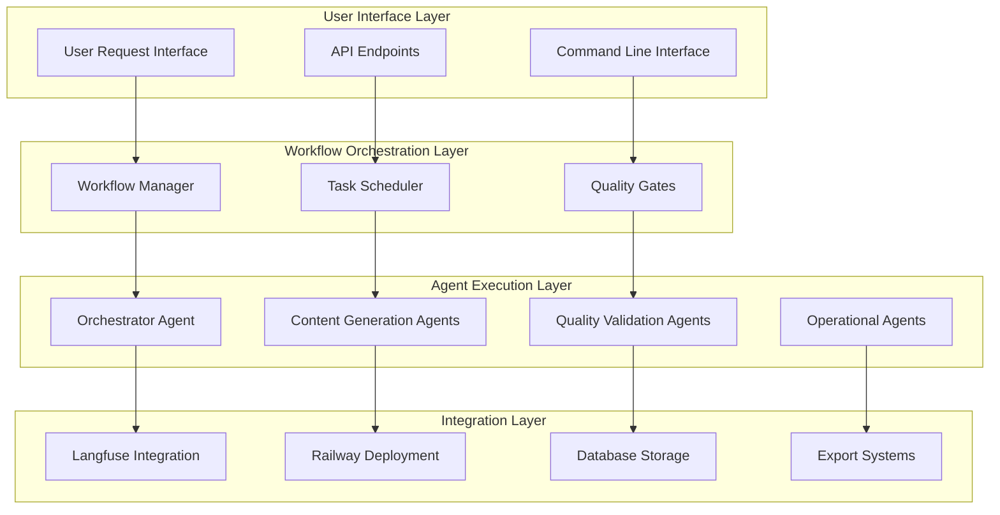

# Workflow Automation for La Factoria Agent System

## 🎯 Overview

This document defines the automated workflows that orchestrate Claude Code agents for educational content generation. The workflows combine manual triggers with intelligent automation to deliver high-quality educational content efficiently while maintaining the simplicity goals of La Factoria.

## 🔄 Core Workflow Architecture

### Workflow Hierarchy



## 📋 Primary Workflow Definitions

### 1. Complete Content Generation Workflow

**Trigger**: User requests complete educational content set for a topic

**Automation Level**: Full automation with quality gates

**Workflow Steps**:

```yaml
complete_content_workflow:
  workflow_id: "complete_content_generation"
  description: "Generate full educational content set with quality validation"
  
  input_parameters:
    topic: "Educational subject or topic"
    grade_level: "Target audience education level"
    learning_objectives: "Specific learning goals"
    content_types: "Subset or all 8 content types"
    quality_thresholds: "Minimum quality requirements"
    delivery_format: "Output format requirements"
  
  automation_stages:
    stage_1_initialization:
      trigger: "User request received"
      automated_actions:
        - Input validation and sanitization
        - Educational standards lookup for grade level
        - Quality threshold configuration
        - Resource allocation and capacity check
        - Workflow instance creation and tracking
      
      agents_involved: ["Security Validation Agent", "Educational Standards Agent"]
      quality_gates:
        - Input safety validation (required)
        - Educational appropriateness check (required)
        - Resource availability confirmation (required)
      
      automation_decisions:
        proceed_criteria: "All quality gates passed"
        fallback_actions: "Error reporting and user notification"
        escalation_triggers: "Unsafe content or resource constraints"
    
    stage_2_research_and_planning:
      trigger: "Initialization stage completed successfully"
      automated_actions:
        - Topic research and source gathering
        - Master outline generation with learning objectives
        - Content complexity analysis and adaptation
        - Agent task allocation and scheduling
        - Dependency mapping for content types
      
      agents_involved: ["Research Agent", "Master Outline Agent", "Orchestrator Agent"]
      quality_gates:
        - Research source credibility (≥ 0.85)
        - Outline educational effectiveness (≥ 0.75)
        - Learning objective alignment (≥ 0.80)
      
      automation_decisions:
        proceed_criteria: "Master outline meets quality thresholds"
        fallback_actions: "Research enhancement and outline refinement"
        escalation_triggers: "Insufficient quality sources or outline issues"
    
    stage_3_parallel_content_generation:
      trigger: "Research and planning completed"
      automated_actions:
        - Parallel agent spawning for content types
        - Context distribution and agent coordination
        - Real-time progress monitoring and adjustment
        - Inter-agent communication facilitation
        - Quality monitoring during generation
      
      agents_involved: 
        - "Podcast Script Agent"
        - "Study Guide Agent"
        - "Reading Material Agent"
        - "FAQ Agent"
        - "Summary Agent"
        - "Flashcard Agent"
        - "Discussion Agent"
      
      quality_gates:
        - Individual content quality (≥ 0.75)
        - Factual accuracy validation (≥ 0.85)
        - Educational standards compliance (≥ 0.80)
        - Cross-content consistency (≥ 0.80)
      
      automation_decisions:
        proceed_criteria: "All content types meet quality thresholds"
        fallback_actions: "Targeted content regeneration for failed items"
        escalation_triggers: "Multiple content types failing quality gates"
    
    stage_4_quality_validation_and_integration:
      trigger: "Content generation completed"
      automated_actions:
        - Comprehensive quality assessment across all content
        - Cross-content validation for consistency
        - Educational effectiveness evaluation
        - Integration of content into unified package
        - Final formatting and optimization
      
      agents_involved: 
        - "Quality Assessment Agent"
        - "Educational Standards Agent"
        - "Factual Validation Agent"
        - "Export Agent"
      
      quality_gates:
        - Overall content set quality (≥ 0.80)
        - Educational effectiveness (≥ 0.75)
        - Factual accuracy comprehensive (≥ 0.85)
        - Content set coherence (≥ 0.85)
      
      automation_decisions:
        proceed_criteria: "Content set meets all quality requirements"
        fallback_actions: "Iterative improvement cycles"
        escalation_triggers: "Quality issues requiring human intervention"
    
    stage_5_delivery_and_documentation:
      trigger: "Quality validation passed"
      automated_actions:
        - Content formatting for requested delivery format
        - Metadata generation and documentation
        - Version control and change tracking
        - Delivery to requesting system or user
        - Performance metrics collection and analysis
      
      agents_involved: ["Export Agent", "Commit Agent"]
      quality_gates:
        - Export format validation (≥ 0.95)
        - Documentation completeness (≥ 0.90)
        - Delivery confirmation (required)
      
      automation_decisions:
        proceed_criteria: "Successful delivery confirmed"
        fallback_actions: "Delivery retry with alternative methods"
        escalation_triggers: "Repeated delivery failures"
  
  workflow_monitoring:
    progress_tracking:
      - Real-time stage completion monitoring
      - Quality gate status tracking
      - Agent performance monitoring
      - Resource utilization tracking
    
    automatic_adjustments:
      - Dynamic quality threshold adjustment
      - Agent reallocation for performance optimization
      - Resource scaling for capacity management
      - Error recovery and workflow continuation
    
    success_criteria:
      - Complete content set delivered (required)
      - Quality thresholds met for all content (required)
      - Delivery within target timeframe (< 8 minutes)
      - User satisfaction metrics (≥ 85%)
```

### 2. Content Optimization Workflow

**Trigger**: Existing content requires quality improvement or updating

**Automation Level**: Semi-automated with intelligent recommendations

```yaml
content_optimization_workflow:
  workflow_id: "content_optimization"
  description: "Improve existing content quality through multi-agent analysis"
  
  input_parameters:
    content_id: "Identifier for existing content"
    optimization_targets: "Specific improvement areas"
    quality_goals: "Target quality scores"
    constraints: "Limitations and requirements"
  
  automation_stages:
    stage_1_content_analysis:
      automated_actions:
        - Existing content quality assessment
        - Gap analysis against current standards
        - Improvement opportunity identification
        - Optimization strategy generation
      
      agents_involved: ["Quality Assessment Agent", "Educational Standards Agent"]
      outputs: "Comprehensive optimization plan with priority recommendations"
    
    stage_2_targeted_improvement:
      automated_actions:
        - Specialized agent deployment for identified improvements
        - Iterative content enhancement cycles
        - Quality monitoring during optimization
        - Cross-content impact assessment
      
      agents_involved: "Relevant content generation and validation agents"
      outputs: "Improved content with measurable quality enhancements"
    
    stage_3_validation_and_delivery:
      automated_actions:
        - Comprehensive quality validation of improved content
        - Comparison with original content for improvement verification
        - Integration with existing content ecosystem
        - Delivery and documentation update
      
      agents_involved: ["Quality Assessment Agent", "Export Agent", "Commit Agent"]
      outputs: "Validated improved content with quality improvement documentation"
```

### 3. Research-Enhanced Content Generation Workflow

**Trigger**: Content requires extensive research and source verification

**Automation Level**: Research-heavy automation with source validation

```yaml
research_enhanced_workflow:
  workflow_id: "research_enhanced_generation"
  description: "Generate content with comprehensive research foundation"
  
  automation_stages:
    stage_1_research_planning:
      automated_actions:
        - Research strategy development
        - Source identification and prioritization
        - Research scope definition
        - Quality source validation
      
      agents_involved: ["Research Agent", "Factual Validation Agent"]
    
    stage_2_research_execution:
      automated_actions:
        - Multi-source research coordination
        - Source credibility verification
        - Information synthesis and organization
        - Research gap identification and filling
      
      agents_involved: ["Research Agent", "Context Optimizer Agent"]
    
    stage_3_research_based_content_generation:
      automated_actions:
        - Research-informed content generation
        - Source integration and citation
        - Fact-checking during generation
        - Research-content alignment validation
      
      agents_involved: "All content generation agents + Research Agent"
```

## 🎮 Interactive Workflow Controls

### Manual Override Points

```yaml
manual_controls:
  quality_gate_overrides:
    description: "Allow manual approval for content that narrowly misses automated thresholds"
    use_cases:
      - Edge cases requiring human judgment
      - Specialized content with unique requirements
      - Emergency content delivery needs
    
    authorization_levels:
      - Educational expert approval required
      - Quality manager override capability
      - System administrator emergency override
  
  workflow_modification:
    description: "Dynamic workflow adjustment during execution"
    capabilities:
      - Priority adjustment for urgent content
      - Quality threshold modification for specific contexts
      - Agent reallocation for performance optimization
      - Stage skipping for simplified workflows
  
  content_steering:
    description: "Human guidance for content direction and focus"
    interaction_points:
      - Topic focus refinement during research
      - Learning objective adjustment during outline
      - Content emphasis modification during generation
      - Quality criteria adjustment during validation
```

### Adaptive Automation

```yaml
adaptive_features:
  learning_integration:
    pattern_recognition:
      - Successful workflow pattern identification
      - Quality improvement strategy effectiveness
      - Agent performance optimization opportunities
      - User preference and feedback integration
    
    automatic_optimization:
      - Workflow step optimization based on performance
      - Quality threshold dynamic adjustment
      - Agent allocation optimization
      - Resource utilization improvement
  
  context_awareness:
    educational_context:
      - Grade level adaptation for workflow complexity
      - Subject matter specialization
      - Cultural and regional requirement adaptation
      - Accessibility requirement integration
    
    performance_context:
      - System load adaptation
      - Resource availability optimization
      - Quality vs. speed trade-off management
      - Error pattern prevention
```

## 🔧 Workflow Templates and Customization

### Template Categories

```yaml
workflow_templates:
  standard_templates:
    complete_content_set:
      description: "Full 8-content-type generation"
      estimated_time: "5-8 minutes"
      quality_focus: "Comprehensive educational coverage"
    
    quick_content_generation:
      description: "Essential content types only"
      estimated_time: "2-3 minutes"
      quality_focus: "Speed with quality maintenance"
    
    high_quality_content:
      description: "Premium quality with extensive validation"
      estimated_time: "10-15 minutes"
      quality_focus: "Maximum educational effectiveness"
  
  specialized_templates:
    research_intensive:
      description: "Heavy research requirements"
      focus: "Source verification and fact-checking"
    
    accessibility_focused:
      description: "Enhanced accessibility features"
      focus: "Universal design and inclusive content"
    
    assessment_heavy:
      description: "Extensive assessment and evaluation content"
      focus: "Testing and evaluation materials"
  
  custom_templates:
    template_creation:
      - User-defined workflow stages
      - Custom quality gates and thresholds
      - Specialized agent configurations
      - Integration with external systems
    
    template_sharing:
      - Community template library
      - Organization-specific templates
      - Best practice template recommendations
      - Template performance analytics
```

### Workflow Customization Framework

```yaml
customization_options:
  stage_modification:
    add_stages:
      - Custom validation requirements
      - Specialized content generation steps
      - Integration with external systems
      - Custom quality assurance processes
    
    modify_stages:
      - Quality threshold adjustment
      - Agent selection modification
      - Process flow optimization
      - Performance requirement changes
    
    remove_stages:
      - Simplified workflows for specific use cases
      - Speed optimization through stage elimination
      - Resource constraint accommodation
      - Emergency workflow simplification
  
  agent_configuration:
    specialized_agents:
      - Custom agent development for specific domains
      - Agent parameter optimization for use cases
      - Integration of external AI services
      - Custom validation and assessment agents
    
    agent_coordination:
      - Custom coordination patterns
      - Modified communication protocols
      - Specialized orchestration strategies
      - Performance optimization configurations
  
  integration_customization:
    external_systems:
      - Learning management system integration
      - Content management system connections
      - Assessment platform coordination
      - Analytics and reporting system integration
    
    data_sources:
      - Custom research source integration
      - Specialized knowledge base connections
      - Real-time data feed integration
      - Educational standard database connections
```

## 📊 Workflow Performance Monitoring

### Real-Time Monitoring

```yaml
monitoring_systems:
  workflow_execution:
    stage_progress:
      - Current stage identification and progress
      - Estimated completion time for each stage
      - Quality gate status and results
      - Agent performance and utilization
    
    performance_metrics:
      - Processing speed and throughput
      - Quality scores throughout workflow
      - Resource utilization efficiency
      - Error rates and recovery times
    
    quality_tracking:
      - Real-time quality assessment
      - Quality trend analysis
      - Threshold compliance monitoring
      - Improvement opportunity identification
  
  agent_coordination:
    communication_efficiency:
      - Inter-agent communication frequency
      - Message processing times
      - Coordination overhead measurement
      - Communication error rates
    
    coordination_effectiveness:
      - Task completion coordination success
      - Quality validation coordination
      - Resource allocation efficiency
      - Error recovery coordination
```

### Analytics and Optimization

```yaml
analytics_framework:
  workflow_analytics:
    performance_analysis:
      - Workflow completion time analysis
      - Quality outcome correlation with workflow patterns
      - Resource utilization optimization opportunities
      - Bottleneck identification and resolution
    
    quality_analytics:
      - Quality score trends and patterns
      - Educational effectiveness measurement
      - User satisfaction correlation
      - Content improvement impact analysis
    
    efficiency_analytics:
      - Automation efficiency measurement
      - Manual intervention frequency analysis
      - Cost-benefit analysis of workflow complexity
      - ROI measurement for quality improvements
  
  continuous_improvement:
    pattern_recognition:
      - Successful workflow pattern identification
      - Quality improvement strategy effectiveness
      - Agent performance optimization opportunities
      - User behavior and preference analysis
    
    automatic_optimization:
      - Workflow parameter automatic tuning
      - Quality threshold dynamic optimization
      - Agent allocation efficiency improvement
      - Resource utilization optimization
```

This workflow automation system provides the foundation for efficient, high-quality educational content generation while maintaining the flexibility and simplicity essential to La Factoria's mission.