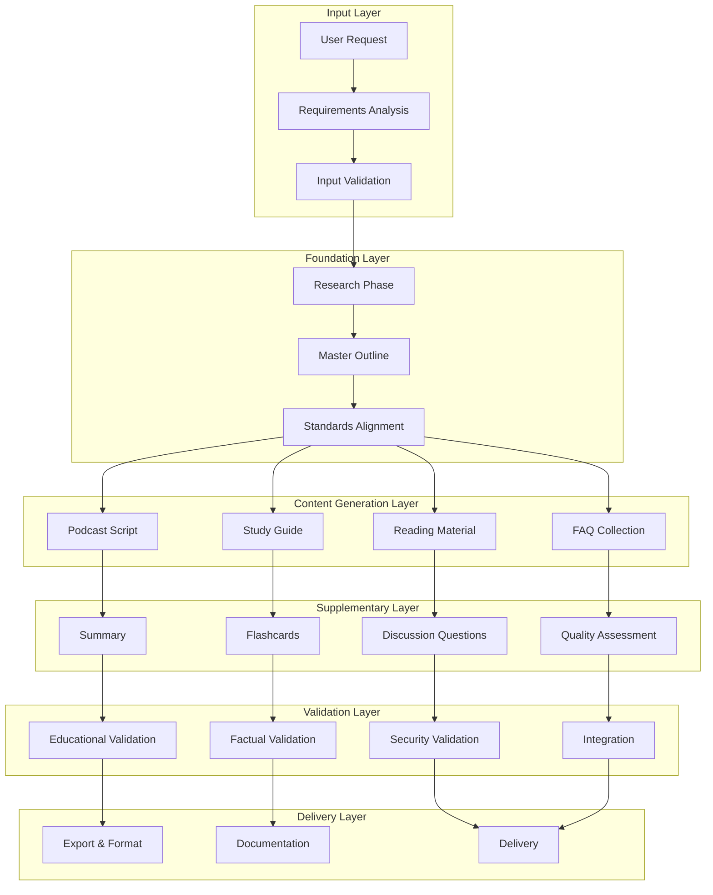

# Educational Content Generation Pipeline

## 🎯 Overview

This document defines the comprehensive educational content generation pipeline that orchestrates Claude Code agents to create La Factoria's 8 educational content types. The pipeline ensures pedagogical excellence, factual accuracy, and age-appropriate delivery while maintaining the project's simplicity goals.

## 🏗️ Pipeline Architecture

### Content Generation Flow



## 📋 Pipeline Stages

### Stage 1: Input Processing and Requirements Analysis

**Purpose**: Transform user requests into structured educational requirements

**Agents Involved**: 
- Security Validation Agent (input sanitization)
- Educational Standards Agent (requirements analysis)
- Research Agent (preliminary topic assessment)

**Process Flow**:
```yaml
input_processing:
  step_1_input_validation:
    actions:
      - Content safety validation
      - PII detection and handling
      - Topic appropriateness assessment
      - Input structure validation
    
    validation_criteria:
      safety_score: ">= 0.95"
      appropriateness_score: ">= 0.85"
      clarity_score: ">= 0.80"
    
    outputs:
      - Sanitized and validated user input
      - Safety assessment report
      - Topic appropriateness evaluation
  
  step_2_requirements_analysis:
    actions:
      - Educational objective identification
      - Grade level and audience analysis
      - Subject matter domain classification
      - Learning outcome specification
      - Constraint identification (time, complexity, etc.)
    
    analysis_criteria:
      objective_clarity: ">= 0.85"
      audience_specificity: ">= 0.80"
      feasibility_assessment: ">= 0.75"
    
    outputs:
      - Structured educational requirements
      - Learning objective hierarchy
      - Audience profile and constraints
      - Success criteria definition
  
  step_3_scope_definition:
    actions:
      - Content type selection and prioritization
      - Quality threshold establishment
      - Resource allocation planning
      - Timeline estimation
    
    scope_criteria:
      content_coverage: "Comprehensive"
      quality_requirements: "Minimum 0.75 educational effectiveness"
      resource_feasibility: "Within system capacity"
    
    outputs:
      - Content generation scope
      - Quality requirements specification
      - Resource allocation plan
      - Project timeline and milestones
```

**Quality Gates**:
- Input safety validation (required)
- Educational appropriateness confirmation (required)
- Requirements completeness check (≥ 0.85)
- Scope feasibility assessment (≥ 0.80)

### Stage 2: Research Foundation and Master Outline

**Purpose**: Establish comprehensive research foundation and create master content outline

**Agents Involved**:
- Research Agent (information gathering)
- Master Outline Agent (structure creation)
- Educational Standards Agent (alignment validation)
- Factual Validation Agent (source verification)

**Process Flow**:
```yaml
foundation_creation:
  step_1_comprehensive_research:
    research_strategy:
      source_diversification:
        - Academic and educational sources
        - Authoritative reference materials
        - Current and relevant examples
        - Multi-perspective information
      
      source_validation:
        - Credibility assessment (≥ 0.85)
        - Currency evaluation (recent and relevant)
        - Bias detection and mitigation
        - Cross-reference verification
      
      knowledge_synthesis:
        - Information organization and categorization
        - Gap identification and additional research
        - Concept relationship mapping
        - Knowledge hierarchy establishment
    
    quality_metrics:
      source_credibility: ">= 0.85"
      information_coverage: ">= 0.80"
      factual_accuracy: ">= 0.90"
      relevance_score: ">= 0.85"
    
    outputs:
      - Comprehensive research database
      - Source credibility assessment
      - Knowledge gap analysis
      - Research quality report
  
  step_2_master_outline_creation:
    outline_development:
      learning_objective_mapping:
        - Primary learning outcomes identification
        - Secondary objective specification
        - Skill development progression
        - Assessment criteria alignment
      
      content_structure_design:
        - Logical information hierarchy
        - Progressive complexity management
        - Cross-content type consistency
        - Educational flow optimization
      
      pedagogical_framework_integration:
        - Bloom's taxonomy alignment
        - Multiple learning modality support
        - Age-appropriate progression
        - Cultural sensitivity consideration
    
    quality_metrics:
      educational_soundness: ">= 0.85"
      logical_progression: ">= 0.80"
      objective_alignment: ">= 0.85"
      age_appropriateness: ">= 0.80"
    
    outputs:
      - Master content outline
      - Learning objective hierarchy
      - Content flow specification
      - Pedagogical framework documentation
  
  step_3_standards_alignment:
    alignment_process:
      educational_standards_mapping:
        - Grade-level standard identification
        - Subject-area requirement alignment
        - Regional/cultural adaptation
        - Accessibility requirement integration
      
      quality_threshold_establishment:
        - Content quality requirements
        - Educational effectiveness thresholds
        - Assessment criteria specification
        - Success metric definition
    
    alignment_metrics:
      standards_compliance: ">= 0.90"
      quality_threshold_appropriateness: ">= 0.85"
      cultural_sensitivity: ">= 0.85"
      accessibility_compliance: ">= 0.80"
    
    outputs:
      - Standards alignment documentation
      - Quality threshold specification
      - Cultural adaptation guidelines
      - Accessibility requirement checklist
```

**Quality Gates**:
- Research source credibility (≥ 0.85)
- Master outline educational effectiveness (≥ 0.85)
- Standards compliance validation (≥ 0.90)
- Foundation completeness assessment (≥ 0.80)

### Stage 3: Primary Content Generation

**Purpose**: Generate core educational content types with specialized expertise

**Agents Involved**:
- Podcast Script Agent
- Study Guide Agent  
- Reading Material Agent
- FAQ Agent
- Supporting agents (Research, Context Optimizer)

**Process Flow**:
```yaml
primary_content_generation:
  parallel_generation_coordination:
    agent_specialization:
      podcast_script_agent:
        focus: "Audio-optimized conversational content"
        specialization: "Narrative flow and engagement"
        quality_emphasis: "Clarity and audio delivery"
        integration_points: "ElevenLabs audio generation"
      
      study_guide_agent:
        focus: "Comprehensive learning material"
        specialization: "Educational depth and practice"
        quality_emphasis: "Learning effectiveness"
        integration_points: "Assessment and exercise integration"
      
      reading_material_agent:
        focus: "Detailed explanatory content"
        specialization: "Academic depth and examples"
        quality_emphasis: "Comprehension and retention"
        integration_points: "Research source integration"
      
      faq_agent:
        focus: "Common questions and misconceptions"
        specialization: "Clarity and accessibility"
        quality_emphasis: "Practical utility"
        integration_points: "Cross-content consistency"
    
    coordination_mechanisms:
      shared_context_management:
        - Master outline adherence
        - Research foundation utilization
        - Cross-content consistency maintenance
        - Quality standard enforcement
      
      real_time_coordination:
        - Progress synchronization
        - Quality gate coordination
        - Resource sharing optimization
        - Dependency management
      
      quality_monitoring:
        - Continuous quality assessment
        - Early warning system for quality issues
        - Iterative improvement triggers
        - Performance optimization
  
  content_development_process:
    foundation_integration:
      - Master outline adherence verification
      - Research foundation utilization
      - Learning objective alignment
      - Educational standard compliance
    
    specialized_content_creation:
      - Agent-specific content generation
      - Format optimization for content type
      - Quality monitoring during creation
      - Iterative refinement based on feedback
    
    cross_content_validation:
      - Consistency verification across content types
      - Complementary content optimization
      - Gap identification and filling
      - Integration preparation
    
    quality_assurance:
      - Individual content quality assessment
      - Educational effectiveness evaluation
      - Factual accuracy validation
      - Age appropriateness confirmation
```

**Quality Gates**:
- Individual content quality (≥ 0.75)
- Cross-content consistency (≥ 0.80)
- Educational effectiveness (≥ 0.75)
- Factual accuracy validation (≥ 0.85)

### Stage 4: Supplementary Content Generation

**Purpose**: Create supporting content that enhances learning and retention

**Agents Involved**:
- Summary Agent
- Flashcard Agent
- Discussion Agent
- Context Optimizer Agent

**Process Flow**:
```yaml
supplementary_content_generation:
  content_synthesis:
    summary_generation:
      synthesis_approach:
        - Key concept extraction from all primary content
        - Information hierarchy optimization
        - Essential takeaway identification
        - Concise presentation formatting
      
      quality_focus:
        - Information density optimization
        - Clarity and accessibility
        - Visual appeal and readability
        - Action-oriented conclusions
    
    flashcard_creation:
      memory_optimization:
        - Cognitive load theory application
        - Spaced repetition consideration
        - Memory aid design
        - Progressive difficulty structuring
      
      content_extraction:
        - Key term identification
        - Concept definition creation
        - Example and application pairing
        - Cross-reference integration
    
    discussion_question_development:
      critical_thinking_facilitation:
        - Socratic method application
        - Multiple perspective encouragement
        - Analysis and synthesis prompts
        - Real-world application questions
      
      comprehension_assessment:
        - Understanding verification questions
        - Application and transfer prompts
        - Creative and innovative thinking stimulation
        - Collaborative discussion facilitation
  
  integration_optimization:
    cross_content_enhancement:
      - Primary content reinforcement
      - Learning pathway optimization
      - Assessment integration
      - Multi-modal learning support
    
    user_experience_optimization:
      - Content accessibility enhancement
      - Navigation and usability improvement
      - Progressive disclosure optimization
      - Engagement and motivation integration
```

**Quality Gates**:
- Content synthesis accuracy (≥ 0.85)
- Memory aid effectiveness (≥ 0.80)
- Discussion quality assessment (≥ 0.75)
- Integration coherence (≥ 0.85)

### Stage 5: Comprehensive Validation and Integration

**Purpose**: Ensure all content meets quality standards and integrates cohesively

**Agents Involved**:
- Educational Standards Agent
- Quality Assessment Agent
- Factual Validation Agent
- Security Validation Agent

**Process Flow**:
```yaml
comprehensive_validation:
  multi_dimensional_assessment:
    educational_effectiveness:
      learning_objective_achievement:
        - Objective coverage completeness
        - Learning outcome alignment
        - Skill development progression
        - Assessment criteria satisfaction
      
      pedagogical_soundness:
        - Educational theory application
        - Age-appropriate methodology
        - Learning style accommodation
        - Engagement and motivation optimization
    
    factual_accuracy:
      comprehensive_fact_checking:
        - Source verification and citation
        - Cross-reference validation
        - Currency and relevance assessment
        - Bias detection and mitigation
      
      accuracy_scoring:
        - Claim verification percentage
        - Source credibility weighting
        - Factual error identification
        - Correction recommendation generation
    
    quality_assessment:
      content_quality_evaluation:
        - Clarity and comprehensibility
        - Organization and structure
        - Engagement and interest level
        - Technical quality and presentation
      
      cross_content_consistency:
        - Terminology and concept consistency
        - Difficulty progression alignment
        - Style and tone uniformity
        - Integration and flow optimization
    
    security_and_safety:
      content_safety_validation:
        - Inappropriate content detection
        - Age-appropriateness verification
        - Cultural sensitivity assessment
        - Privacy and safety compliance
      
      technical_security:
        - Data handling compliance
        - Privacy protection verification
        - Security best practice adherence
        - Vulnerability assessment
  
  integration_and_optimization:
    content_set_integration:
      - Cross-content relationship optimization
      - Navigation and flow enhancement
      - Redundancy elimination
      - Gap filling and completion
    
    final_optimization:
      - Performance optimization
      - User experience enhancement
      - Accessibility improvement
      - Quality score maximization
```

**Quality Gates**:
- Overall content set quality (≥ 0.80)
- Educational effectiveness (≥ 0.75)
- Factual accuracy comprehensive (≥ 0.85)
- Safety and compliance (≥ 0.95)

### Stage 6: Export and Delivery

**Purpose**: Format, document, and deliver the complete educational content set

**Agents Involved**:
- Export Agent
- Commit Agent

**Process Flow**:
```yaml
export_and_delivery:
  content_formatting:
    multi_format_export:
      - JSON structured data export
      - Markdown formatted content
      - HTML web-ready presentation
      - PDF print-ready formatting
    
    metadata_generation:
      - Content descriptive metadata
      - Quality assessment results
      - Educational standard alignments
      - Usage and implementation guidelines
  
  documentation_creation:
    comprehensive_documentation:
      - Content set overview and usage guide
      - Quality assessment summary
      - Educational implementation recommendations
      - Assessment and evaluation guidelines
    
    version_control:
      - Content versioning and tracking
      - Change documentation
      - Quality improvement history
      - Performance metrics recording
  
  delivery_coordination:
    delivery_validation:
      - Format integrity verification
      - Content completeness confirmation
      - Documentation accuracy check
      - Delivery requirement satisfaction
    
    system_integration:
      - Backend system integration
      - Database storage coordination
      - API endpoint delivery
      - User notification and confirmation
```

**Quality Gates**:
- Export format validation (≥ 0.95)
- Documentation completeness (≥ 0.90)
- Delivery confirmation (required)
- System integration success (required)

## 📊 Pipeline Performance Metrics

### Efficiency Metrics

```yaml
performance_measurement:
  speed_metrics:
    stage_completion_times:
      input_processing: "< 30 seconds"
      foundation_creation: "< 90 seconds"
      primary_content_generation: "< 180 seconds"
      supplementary_content: "< 60 seconds"
      validation_integration: "< 120 seconds"
      export_delivery: "< 30 seconds"
      total_pipeline: "< 8 minutes"
    
    throughput_optimization:
      parallel_processing_efficiency: "> 85%"
      agent_utilization_rate: "> 80%"
      resource_optimization: "> 90%"
  
  quality_metrics:
    content_quality_scores:
      average_content_quality: ">= 0.80"
      educational_effectiveness: ">= 0.75"
      factual_accuracy: ">= 0.85"
      user_satisfaction: ">= 0.85"
    
    consistency_metrics:
      cross_content_consistency: ">= 0.85"
      standard_compliance: ">= 0.90"
      quality_gate_pass_rate: ">= 95%"
  
  reliability_metrics:
    pipeline_success_rate: ">= 95%"
    error_recovery_time: "< 30 seconds"
    quality_gate_effectiveness: ">= 90%"
    system_availability: ">= 99%"
```

### Educational Outcome Metrics

```yaml
educational_effectiveness:
  learning_outcomes:
    objective_achievement_rate: ">= 85%"
    skill_development_progression: "Measurable improvement"
    knowledge_retention_rate: ">= 80%"
    application_and_transfer: ">= 75%"
  
  engagement_metrics:
    content_engagement_level: ">= 0.75"
    completion_rate: ">= 80%"
    user_satisfaction_score: ">= 0.85"
    return_usage_rate: ">= 70%"
  
  quality_improvement:
    content_quality_trend: "Continuous improvement"
    educational_effectiveness_growth: "> 5% quarterly"
    user_feedback_integration: "Active incorporation"
    best_practice_evolution: "Ongoing optimization"
```

This content generation pipeline ensures the delivery of high-quality, educationally effective content while maintaining the efficiency and simplicity goals of La Factoria's educational platform.