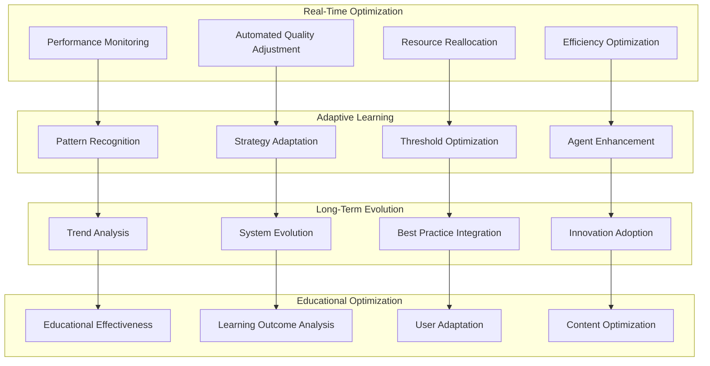

# Continuous Optimization Workflows for La Factoria Agent System

## 🎯 Overview

This document defines the continuous optimization workflows that enable La Factoria's agent system to learn, improve, and adapt over time. These optimization loops ensure the system becomes more effective, efficient, and educationally impactful through iterative refinement and intelligent adaptation.

## 🔄 Optimization Architecture

### Multi-Layer Optimization Model



## 🚀 Real-Time Optimization Loops

### 1. Performance Monitoring and Adjustment

**Purpose**: Continuously monitor system performance and make immediate optimizations

**Optimization Cycle**:
```yaml
real_time_performance_optimization:
  monitoring_systems:
    agent_performance_tracking:
      metrics:
        - Task completion time and efficiency
        - Quality score achievements
        - Resource utilization rates
        - Error rates and recovery times
        - Communication effectiveness
      
      collection_frequency: "Every 30 seconds"
      analysis_triggers: "Performance deviation > 10%"
      
    quality_monitoring:
      metrics:
        - Content quality scores in real-time
        - Educational effectiveness indicators
        - User engagement measurements
        - Factual accuracy validation results
      
      collection_frequency: "Per content piece generated"
      analysis_triggers: "Quality threshold approached or breached"
    
    resource_utilization_tracking:
      metrics:
        - Computational resource usage
        - Memory and context utilization
        - Communication bandwidth usage
        - Storage and data transfer rates
      
      collection_frequency: "Every 10 seconds"
      analysis_triggers: "Resource constraint approaching"
  
  automatic_adjustments:
    performance_optimization:
      agent_reallocation:
        trigger: "Agent performance below threshold"
        action: "Redistribute tasks to higher-performing agents"
        validation: "Performance improvement within 60 seconds"
      
      quality_threshold_adjustment:
        trigger: "Quality scores consistently above/below targets"
        action: "Dynamic threshold optimization for optimal outcomes"
        validation: "Educational effectiveness maintained or improved"
      
      resource_scaling:
        trigger: "Resource utilization exceeding optimal ranges"
        action: "Dynamic resource allocation adjustment"
        validation: "System performance maintained with efficiency gains"
    
    immediate_corrections:
      error_recovery:
        trigger: "Agent or system errors detected"
        action: "Automatic error recovery and task redistribution"
        validation: "Error resolved within target time"
      
      quality_intervention:
        trigger: "Quality gate failure imminent"
        action: "Enhanced quality measures deployment"
        validation: "Quality threshold achievement"
```

### 2. Adaptive Quality Optimization

**Purpose**: Continuously improve content quality through intelligent adaptation

**Optimization Process**:
```yaml
adaptive_quality_optimization:
  quality_pattern_recognition:
    successful_pattern_identification:
      analysis_scope:
        - High-quality content characteristics
        - Effective agent coordination patterns
        - Successful educational approach identification
        - Optimal resource allocation strategies
      
      pattern_extraction:
        - Content structure and organization patterns
        - Language and presentation style analysis
        - Educational methodology effectiveness
        - User engagement correlation factors
      
      pattern_validation:
        - Cross-validation across content types
        - Educational effectiveness confirmation
        - User satisfaction correlation
        - Long-term learning outcome verification
    
    failure_pattern_analysis:
      failure_identification:
        - Quality threshold failure analysis
        - Educational ineffectiveness root causes
        - User dissatisfaction pattern recognition
        - System performance degradation factors
      
      prevention_strategy_development:
        - Proactive quality issue prevention
        - Early warning system enhancement
        - Risk mitigation strategy optimization
        - Error prevention mechanism improvement
  
  dynamic_quality_enhancement:
    threshold_optimization:
      adaptive_thresholds:
        - Performance-based quality threshold adjustment
        - Educational outcome correlation optimization
        - User satisfaction balance maintenance
        - Resource efficiency consideration
      
      context_aware_adjustment:
        - Grade-level specific optimization
        - Subject-matter specialized requirements
        - Cultural and regional adaptation
        - Individual learner customization
    
    quality_strategy_evolution:
      methodology_refinement:
        - Educational approach optimization
        - Content generation strategy enhancement
        - Validation process improvement
        - Integration pattern optimization
      
      agent_capability_enhancement:
        - Agent performance optimization
        - Specialized skill development
        - Coordination effectiveness improvement
        - Quality assessment accuracy enhancement
```

## 🧠 Adaptive Learning Systems

### 1. Pattern Recognition and Strategy Adaptation

**Purpose**: Learn from successful patterns and adapt strategies accordingly

**Learning Framework**:
```yaml
pattern_recognition_and_adaptation:
  multi_dimensional_pattern_analysis:
    content_pattern_recognition:
      successful_content_characteristics:
        - Educational effectiveness correlation factors
        - User engagement optimization elements
        - Learning outcome achievement patterns
        - Cross-content synergy identification
      
      content_optimization_patterns:
        - Structure and organization effectiveness
        - Language and presentation optimization
        - Multimedia integration success factors
        - Assessment and evaluation enhancement
    
    agent_coordination_patterns:
      effective_coordination_identification:
        - Successful multi-agent collaboration patterns
        - Optimal task allocation strategies
        - Efficient communication protocol usage
        - Quality assurance coordination effectiveness
      
      coordination_optimization:
        - Communication efficiency enhancement
        - Resource allocation optimization
        - Quality gate coordination improvement
        - Error recovery coordination effectiveness
    
    user_interaction_patterns:
      engagement_pattern_analysis:
        - High engagement content characteristics
        - Effective learning pathway identification
        - Motivation and interest correlation factors
        - Completion rate optimization elements
      
      satisfaction_correlation_analysis:
        - User satisfaction driver identification
        - Content preference pattern recognition
        - Learning style accommodation effectiveness
        - Accessibility and inclusion success factors
  
  strategy_adaptation_mechanisms:
    content_generation_strategy_evolution:
      adaptive_content_creation:
        - Successful pattern integration into generation processes
        - Educational approach optimization based on outcomes
        - Quality enhancement strategy refinement
        - User preference accommodation improvement
      
      specialized_strategy_development:
        - Subject-matter specific optimization strategies
        - Age-group targeted approach refinement
        - Cultural adaptation strategy enhancement
        - Individual learner customization advancement
    
    agent_coordination_optimization:
      coordination_pattern_evolution:
        - Successful coordination pattern adoption
        - Communication protocol optimization
        - Resource allocation strategy enhancement
        - Quality assurance process refinement
      
      agent_role_optimization:
        - Agent specialization enhancement
        - Task allocation optimization
        - Performance-based role adaptation
        - Coordination effectiveness improvement
```

### 2. Educational Effectiveness Optimization

**Purpose**: Continuously improve educational outcomes through data-driven optimization

**Educational Learning Loops**:
```yaml
educational_effectiveness_optimization:
  learning_outcome_analysis:
    outcome_measurement:
      direct_measurement:
        - Learning objective achievement rates
        - Skill development progression tracking
        - Knowledge retention assessment
        - Application and transfer evaluation
      
      indirect_measurement:
        - User engagement correlation analysis
        - Content completion rate correlation
        - Satisfaction and learning outcome relationships
        - Long-term retention and application tracking
    
    outcome_correlation_analysis:
      content_effectiveness_correlation:
        - Content type and learning outcome relationships
        - Educational approach effectiveness analysis
        - Presentation style and comprehension correlation
        - Assessment method and outcome alignment
      
      optimization_opportunity_identification:
        - Underperforming content area identification
        - Educational approach enhancement opportunities
        - User experience improvement potential
        - Accessibility and inclusion advancement areas
  
  pedagogical_optimization:
    educational_theory_integration:
      theory_application_analysis:
        - Learning science research integration effectiveness
        - Educational psychology principle application
        - Cognitive science insight implementation
        - Instructional design methodology optimization
      
      theory_adaptation_refinement:
        - Educational approach customization for digital learning
        - AI-assisted learning optimization strategies
        - Personalized learning pathway development
        - Adaptive assessment and feedback integration
    
    instructional_design_enhancement:
      design_pattern_optimization:
        - Effective instructional sequence identification
        - Optimal content organization patterns
        - Engagement and motivation strategy enhancement
        - Assessment and evaluation methodology improvement
      
      user_experience_optimization:
        - Learning interface effectiveness enhancement
        - Navigation and usability improvement
        - Accessibility and universal design advancement
        - Mobile and multi-device optimization
```

## 📈 Long-Term Evolution Systems

### 1. System Evolution and Innovation Integration

**Purpose**: Drive long-term system improvement through trend analysis and innovation adoption

**Evolution Framework**:
```yaml
long_term_system_evolution:
  trend_analysis_and_forecasting:
    educational_trend_monitoring:
      trend_identification:
        - Educational methodology evolution tracking
        - Learning technology advancement monitoring
        - Pedagogical research development analysis
        - User expectation and preference evolution
      
      impact_assessment:
        - Educational effectiveness impact evaluation
        - System performance influence analysis
        - User satisfaction correlation assessment
        - Resource requirement and efficiency analysis
    
    technology_advancement_integration:
      ai_and_machine_learning_advancement:
        - Natural language processing improvement integration
        - Educational AI research advancement adoption
        - Machine learning optimization technique implementation
        - Cognitive computing advancement utilization
      
      educational_technology_innovation:
        - Learning platform innovation adoption
        - Assessment technology advancement integration
        - Accessibility technology improvement implementation
        - User experience innovation incorporation
  
  best_practice_evolution:
    industry_best_practice_integration:
      educational_content_standards:
        - Academic publishing standard adoption
        - Educational quality assurance best practice implementation
        - Accessibility and inclusion standard advancement
        - Cultural sensitivity and global adaptation improvement
      
      technology_best_practice_adoption:
        - AI ethics and responsible AI practice implementation
        - Data privacy and security best practice enhancement
        - System reliability and performance optimization
        - User experience and interface design advancement
    
    innovation_experimentation:
      experimental_feature_development:
        - Novel educational approach experimentation
        - Advanced AI technique pilot implementation
        - User experience innovation testing
        - Quality assurance methodology advancement
      
      controlled_innovation_deployment:
        - A/B testing for innovation effectiveness
        - Gradual rollout with performance monitoring
        - User feedback integration for innovation refinement
        - Success metric validation and scaling decision
```

### 2. Ecosystem-Wide Optimization

**Purpose**: Optimize the entire educational content ecosystem for maximum impact

**Ecosystem Optimization**:
```yaml
ecosystem_optimization:
  cross_system_integration:
    external_system_optimization:
      learning_management_system_integration:
        - LMS compatibility and integration enhancement
        - Assessment system coordination optimization
        - Progress tracking and analytics integration
        - User experience seamless transition improvement
      
      educational_platform_ecosystem:
        - Multi-platform content distribution optimization
        - Cross-platform user experience consistency
        - Data sharing and analytics integration
        - Collaborative learning environment enhancement
    
    stakeholder_ecosystem_optimization:
      educator_experience_enhancement:
        - Teacher and instructor tool optimization
        - Curriculum integration facilitation
        - Assessment and evaluation support improvement
        - Professional development resource enhancement
      
      learner_ecosystem_improvement:
        - Personalized learning pathway optimization
        - Peer collaboration and social learning enhancement
        - Progress tracking and motivation system improvement
        - Accessibility and inclusion ecosystem advancement
  
  global_impact_optimization:
    scalability_and_accessibility:
      global_accessibility_enhancement:
        - Multi-language and localization optimization
        - Cultural adaptation and sensitivity improvement
        - Economic accessibility and affordability enhancement
        - Technology accessibility and inclusion advancement
      
      impact_measurement_and_optimization:
        - Educational outcome impact measurement
        - Social and economic impact assessment
        - Environmental sustainability consideration
        - Ethical impact evaluation and enhancement
```

## 📊 Optimization Metrics and Monitoring

### Comprehensive Optimization Dashboard

```yaml
optimization_metrics:
  real_time_optimization_indicators:
    performance_improvement_rate:
      measurement: "System performance enhancement over time"
      target: "Continuous positive trend with >= 5% quarterly improvement"
      tracking: "Real-time performance monitoring with historical analysis"
    
    quality_optimization_effectiveness:
      measurement: "Content quality score improvement and consistency"
      target: "Average quality score >= 0.80 with improving trend"
      tracking: "Quality score trending with educational outcome correlation"
    
    efficiency_enhancement:
      measurement: "Resource utilization optimization and cost reduction"
      target: "Resource efficiency improvement >= 10% quarterly"
      tracking: "Resource utilization monitoring with cost-benefit analysis"
  
  adaptive_learning_indicators:
    pattern_recognition_accuracy:
      measurement: "Successful pattern identification and application rate"
      target: "Pattern recognition accuracy >= 85% with improvement trend"
      tracking: "Pattern validation and success rate monitoring"
    
    strategy_adaptation_effectiveness:
      measurement: "Strategy change impact on educational outcomes"
      target: "Strategy adaptation improvement >= 15% per implementation"
      tracking: "Before/after analysis with educational outcome correlation"
    
    learning_velocity:
      measurement: "System learning and improvement speed"
      target: "Measurable improvement within <= 2 weeks of pattern identification"
      tracking: "Learning cycle time measurement with effectiveness validation"
  
  long_term_evolution_indicators:
    innovation_integration_success:
      measurement: "Successful innovation adoption and impact rate"
      target: "Innovation success rate >= 70% with positive impact"
      tracking: "Innovation pilot success rate with long-term impact assessment"
    
    ecosystem_optimization_impact:
      measurement: "Cross-system integration effectiveness and user satisfaction"
      target: "Ecosystem integration satisfaction >= 85% with improving trend"
      tracking: "Multi-stakeholder satisfaction monitoring with impact measurement"
    
    educational_impact_growth:
      measurement: "Long-term educational outcome improvement and reach"
      target: "Educational impact growth >= 20% annually"
      tracking: "Longitudinal educational outcome analysis with reach measurement"
```

### Optimization Reporting and Analysis

```yaml
reporting_framework:
  real_time_dashboards:
    optimization_status_dashboard:
      - Current optimization activities and progress
      - Performance improvement trends and projections
      - Quality enhancement status and effectiveness
      - Resource optimization results and efficiency gains
    
    alert_and_notification_system:
      - Optimization opportunity identification alerts
      - Performance degradation early warning system
      - Quality threshold breach notification
      - Resource constraint and efficiency opportunity alerts
  
  periodic_optimization_reports:
    weekly_optimization_summary:
      - Optimization activity summary and results
      - Performance improvement measurement and analysis
      - Quality enhancement progress and effectiveness
      - Resource utilization optimization and efficiency gains
    
    monthly_strategic_optimization_review:
      - Strategic optimization initiative progress
      - Long-term trend analysis and forecasting
      - Innovation integration results and planning
      - Ecosystem optimization impact assessment
    
    quarterly_evolution_assessment:
      - System evolution progress and impact measurement
      - Best practice integration effectiveness analysis
      - Innovation adoption success rate and impact
      - Educational outcome improvement and ecosystem impact
```

This continuous optimization system ensures that La Factoria's agent system evolves and improves constantly, delivering increasingly effective educational content while maintaining efficiency and simplicity.