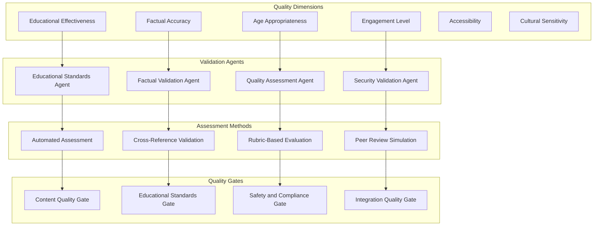

# Educational Content Quality Assurance Workflow

## 🎯 Overview

This document defines the comprehensive quality assurance workflow that ensures all educational content generated by La Factoria's agent system meets the highest standards for educational effectiveness, factual accuracy, and pedagogical soundness. The QA workflow operates as both an integrated component of the content generation pipeline and a standalone validation system.

## 🏗️ Quality Assurance Architecture

### Multi-Dimensional Quality Framework



## 🔍 Quality Assessment Dimensions

### 1. Educational Effectiveness Assessment

**Purpose**: Evaluate content's ability to achieve stated learning objectives

**Assessment Criteria**:
```yaml
educational_effectiveness:
  learning_objective_alignment:
    criteria:
      - Objective coverage completeness (≥ 0.85)
      - Learning outcome specificity (≥ 0.80)
      - Skill development progression (≥ 0.80)
      - Assessment alignment (≥ 0.85)
    
    assessment_methods:
      - Bloom's taxonomy mapping
      - Learning objective achievement analysis
      - Skill progression validation
      - Assessment criteria alignment check
    
    quality_indicators:
      comprehensive_coverage: "All stated objectives addressed"
      appropriate_depth: "Sufficient detail for objective achievement"
      clear_progression: "Logical skill building sequence"
      measurable_outcomes: "Specific, assessable learning goals"
  
  pedagogical_soundness:
    criteria:
      - Educational theory application (≥ 0.80)
      - Learning science alignment (≥ 0.80)
      - Instructional design quality (≥ 0.85)
      - Motivation and engagement (≥ 0.75)
    
    assessment_methods:
      - Educational theory compliance check
      - Learning science principle validation
      - Instructional design pattern analysis
      - Engagement and motivation factor assessment
    
    quality_indicators:
      theory_based: "Grounded in established educational theory"
      evidence_informed: "Aligned with learning science research"
      well_designed: "Effective instructional design principles"
      motivating: "Elements that promote learner engagement"
  
  age_appropriateness:
    criteria:
      - Language complexity (≥ 0.80)
      - Cognitive load management (≥ 0.85)
      - Developmental stage alignment (≥ 0.80)
      - Prior knowledge assumptions (≥ 0.80)
    
    assessment_methods:
      - Reading level analysis
      - Cognitive complexity assessment
      - Developmental psychology alignment
      - Prerequisites and assumptions validation
    
    quality_indicators:
      appropriate_language: "Language suitable for target age group"
      manageable_complexity: "Cognitive load within acceptable limits"
      developmentally_aligned: "Content matches developmental stage"
      accessible_prerequisites: "Reasonable prior knowledge assumptions"
```

### 2. Factual Accuracy Validation

**Purpose**: Ensure all factual claims are accurate, current, and properly sourced

**Validation Process**:
```yaml
factual_accuracy:
  fact_extraction_and_verification:
    automated_fact_extraction:
      - Factual claim identification using NLP
      - Statistical data and numerical claim extraction
      - Historical fact and date verification
      - Scientific concept and principle validation
    
    source_verification:
      - Primary source identification and validation
      - Authority and credibility assessment
      - Currency and relevance evaluation
      - Cross-reference verification across sources
    
    accuracy_scoring:
      verification_criteria:
        source_credibility: ">= 0.85"
        claim_verification: ">= 0.90"
        currency_score: ">= 0.80"
        cross_reference_consistency: ">= 0.85"
  
  bias_detection_and_mitigation:
    bias_identification:
      - Political and ideological bias detection
      - Cultural and regional bias assessment
      - Gender and demographic bias evaluation
      - Commercial and interest bias identification
    
    mitigation_strategies:
      - Multiple perspective inclusion
      - Neutral language recommendation
      - Balanced representation guidance
      - Source diversity requirement
    
    bias_scoring:
      neutrality_score: ">= 0.80"
      perspective_balance: ">= 0.75"
      inclusive_representation: ">= 0.80"
      commercial_independence: ">= 0.90"
  
  currency_and_relevance:
    temporal_accuracy:
      - Information currency assessment
      - Historical context appropriateness
      - Future prediction reasonableness
      - Trend and development accuracy
    
    contextual_relevance:
      - Subject matter relevance
      - Audience relevance and applicability
      - Geographic and cultural relevance
      - Practical utility and application
```

### 3. Engagement and Accessibility Assessment

**Purpose**: Evaluate content's ability to engage learners and accommodate diverse needs

**Assessment Framework**:
```yaml
engagement_and_accessibility:
  engagement_evaluation:
    interest_and_motivation:
      - Content relevance to learner interests
      - Real-world application and utility
      - Challenge level appropriateness
      - Curiosity and exploration encouragement
    
    interactivity_and_participation:
      - Active learning opportunity assessment
      - Participatory element evaluation
      - Social learning facilitation
      - Self-directed learning support
    
    multimedia_and_presentation:
      - Visual appeal and design quality
      - Multimedia integration effectiveness
      - Information presentation clarity
      - Navigation and usability assessment
  
  accessibility_compliance:
    universal_design_principles:
      - Multiple learning modality support
      - Flexible presentation options
      - Alternative format availability
      - Assistive technology compatibility
    
    inclusive_design:
      - Language accessibility and clarity
      - Cultural inclusivity and sensitivity
      - Socioeconomic accessibility
      - Neurodiversity accommodation
    
    technical_accessibility:
      - Screen reader compatibility
      - Keyboard navigation support
      - Color contrast and visual clarity
      - Mobile device optimization
```

## 🚦 Quality Gate System

### Progressive Quality Gates

```yaml
quality_gate_system:
  gate_1_content_creation:
    trigger: "Individual content piece generated"
    validation_scope: "Single content item"
    
    criteria:
      basic_quality: ">= 0.70"
      factual_accuracy: ">= 0.85"
      age_appropriateness: ">= 0.80"
      safety_compliance: ">= 0.95"
    
    actions:
      pass: "Content approved for integration"
      fail: "Content returned for revision with specific feedback"
      conditional: "Content flagged for enhanced review"
    
    agents_involved: ["Quality Assessment Agent", "Factual Validation Agent"]
  
  gate_2_content_integration:
    trigger: "Multiple content pieces ready for integration"
    validation_scope: "Content set consistency and coherence"
    
    criteria:
      cross_content_consistency: ">= 0.85"
      educational_coherence: ">= 0.80"
      comprehensive_coverage: ">= 0.80"
      integration_quality: ">= 0.85"
    
    actions:
      pass: "Content set approved for final validation"
      fail: "Content set returned for coherence improvement"
      partial: "Specific content items flagged for revision"
    
    agents_involved: ["Educational Standards Agent", "Quality Assessment Agent"]
  
  gate_3_comprehensive_validation:
    trigger: "Complete content set ready for delivery"
    validation_scope: "Full educational content package"
    
    criteria:
      overall_quality: ">= 0.80"
      educational_effectiveness: ">= 0.75"
      comprehensive_accuracy: ">= 0.85"
      accessibility_compliance: ">= 0.80"
      user_experience_quality: ">= 0.80"
    
    actions:
      pass: "Content approved for delivery"
      fail: "Content returned for comprehensive revision"
      enhancement: "Content approved with improvement recommendations"
    
    agents_involved: ["All Validation Agents", "Educational Standards Agent"]
  
  gate_4_delivery_validation:
    trigger: "Content package prepared for delivery"
    validation_scope: "Final formatting and delivery readiness"
    
    criteria:
      format_integrity: ">= 0.95"
      documentation_completeness: ">= 0.90"
      delivery_specification_compliance: ">= 0.95"
      system_integration_readiness: ">= 0.90"
    
    actions:
      pass: "Content released for delivery"
      fail: "Content returned for format/documentation correction"
    
    agents_involved: ["Export Agent", "Quality Assessment Agent"]
```

## 🔄 Quality Improvement Workflows

### Iterative Improvement Process

```yaml
improvement_workflows:
  failure_recovery_workflow:
    quality_gate_failure:
      immediate_actions:
        - Specific failure analysis and root cause identification
        - Targeted feedback generation for content creators
        - Priority assessment based on failure severity
        - Resource allocation for improvement efforts
      
      improvement_process:
        - Agent reallocation for focused improvement
        - Specialized enhancement strategies deployment
        - Quality monitoring during improvement cycles
        - Progress tracking and milestone assessment
      
      validation_cycle:
        - Enhanced validation for improved content
        - Comparative quality assessment (before/after)
        - Success criteria verification
        - Approval for progression or additional iteration
  
  continuous_improvement_workflow:
    performance_analysis:
      quality_trend_monitoring:
        - Quality score trending over time
        - Educational effectiveness improvement tracking
        - User satisfaction correlation analysis
        - Best practice identification and propagation
      
      pattern_recognition:
        - Successful content pattern identification
        - Quality improvement strategy effectiveness
        - Agent performance optimization opportunities
        - User feedback integration for improvement
    
    system_optimization:
      quality_threshold_adjustment:
        - Performance-based threshold optimization
        - Educational outcome correlation analysis
        - User satisfaction balance optimization
        - Resource efficiency consideration
      
      agent_enhancement:
        - Agent performance analysis and optimization
        - Specialized training and capability enhancement
        - Coordination pattern improvement
        - Quality assessment methodology refinement
```

### Quality Assurance Automation

```yaml
automation_systems:
  automated_quality_checks:
    real_time_monitoring:
      - Content quality continuous assessment
      - Educational effectiveness tracking
      - Factual accuracy validation
      - User engagement monitoring
    
    intelligent_flagging:
      - Quality concern early detection
      - Educational standard deviation alerts
      - Factual accuracy warning systems
      - Engagement drop notifications
    
    proactive_improvement:
      - Quality degradation prevention
      - Educational effectiveness optimization
      - Factual accuracy enhancement
      - User experience improvement
  
  smart_quality_recommendations:
    adaptive_suggestions:
      - Content-specific improvement recommendations
      - Educational effectiveness enhancement strategies
      - Engagement optimization suggestions
      - Accessibility improvement guidance
    
    context_aware_optimization:
      - Age-group specific optimizations
      - Subject-matter specialized improvements
      - Cultural adaptation recommendations
      - Individual learner customization
```

## 📊 Quality Metrics and Reporting

### Comprehensive Quality Dashboard

```yaml
quality_metrics:
  primary_quality_indicators:
    educational_effectiveness:
      measurement: "Learning objective achievement rate"
      target: ">= 0.75"
      tracking: "Real-time with historical trending"
    
    factual_accuracy:
      measurement: "Verified fact percentage and source credibility"
      target: ">= 0.85"
      tracking: "Automated validation with manual review"
    
    user_satisfaction:
      measurement: "User feedback and engagement metrics"
      target: ">= 0.85"
      tracking: "Continuous user feedback integration"
    
    accessibility_compliance:
      measurement: "Universal design and accessibility standards"
      target: ">= 0.80"
      tracking: "Automated accessibility scanning"
  
  secondary_quality_indicators:
    content_consistency:
      measurement: "Cross-content coherence and integration"
      target: ">= 0.85"
      tracking: "Automated consistency analysis"
    
    engagement_level:
      measurement: "User interaction and completion rates"
      target: ">= 0.75"
      tracking: "Usage analytics and engagement monitoring"
    
    improvement_velocity:
      measurement: "Quality improvement rate over time"
      target: "Continuous positive trend"
      tracking: "Performance trending and analysis"
  
  quality_reporting:
    real_time_dashboard:
      - Current quality status for all active content
      - Quality gate status and processing queue
      - Agent performance and efficiency metrics
      - User satisfaction and feedback integration
    
    periodic_reports:
      - Weekly quality summary and trend analysis
      - Monthly educational effectiveness assessment
      - Quarterly improvement and optimization review
      - Annual quality system performance evaluation
    
    alert_systems:
      - Immediate quality threshold breach notifications
      - Educational standard compliance alerts
      - User satisfaction degradation warnings
      - System performance and reliability notifications
```

### Quality Benchmarking and Standards

```yaml
benchmarking_framework:
  internal_benchmarks:
    historical_performance:
      - Content quality score improvements over time
      - Educational effectiveness enhancement tracking
      - User satisfaction growth measurement
      - System efficiency and reliability improvement
    
    cross_content_comparison:
      - Content type quality performance comparison
      - Subject matter effectiveness analysis
      - Age group optimization effectiveness
      - Cultural adaptation success measurement
  
  external_benchmarks:
    industry_standards:
      - Educational content industry quality standards
      - Academic publication quality requirements
      - Educational technology effectiveness benchmarks
      - Accessibility and inclusive design standards
    
    best_practice_integration:
      - Educational research best practice adoption
      - Learning science advancement integration
      - Quality assurance methodology improvement
      - User experience optimization advancement
  
  continuous_standard_evolution:
    adaptive_quality_thresholds:
      - Performance-based threshold optimization
      - User outcome correlation analysis
      - Educational effectiveness maximization
      - Resource efficiency balance maintenance
    
    innovation_integration:
      - Educational technology advancement adoption
      - Quality assessment methodology innovation
      - User experience enhancement integration
      - Accessibility and inclusion advancement
```

This quality assurance workflow ensures that La Factoria's educational content consistently meets the highest standards for educational effectiveness, accuracy, and user experience while maintaining the efficiency and simplicity goals of the platform.