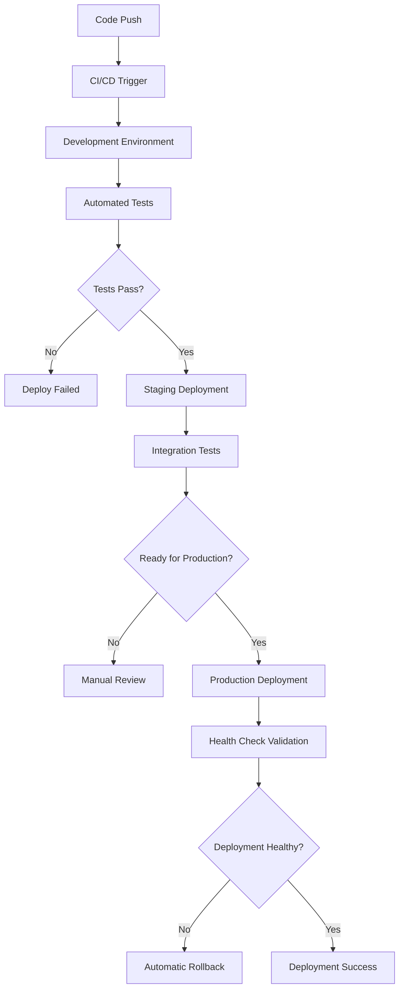

# Multi-Environment Deployment and Management Framework

## Context Imports (Anthropic-Compliant)

### Core Infrastructure Context
@.claude/context/railway.md
@.claude/context/fastapi.md
@.claude/operations/context-system-backup-recovery.md

### Scalability and Operations Context
@.claude/scalability/advanced-scalability-framework.md
@.claude/operations/context-system-maintenance-procedures.md
@.claude/security/context-system-security-compliance.md

### Architecture and Implementation Context
@.claude/architecture/project-overview.md
@.claude/examples/backend/fastapi-setup/main.py
@.claude/prp/PRP-005-Deployment-Operations.md

## Executive Summary

The Multi-Environment Deployment and Management Framework provides comprehensive automated deployment pipelines, environment configuration management, and cross-environment synchronization capabilities for La Factoria's educational content generation platform.

**Key Capabilities**:
- **Automated Multi-Environment Deployment**: Seamless deployment across development, staging, and production
- **Environment Configuration Management**: Centralized configuration with environment-specific overrides
- **Database Migration Management**: Automated schema migrations with rollback capabilities
- **Secret Management**: Secure handling of API keys and sensitive configuration across environments
- **Health Monitoring**: Comprehensive health checks and deployment validation
- **Rollback Mechanisms**: Instant rollback capabilities with data integrity preservation

## Multi-Environment Architecture

### Environment Structure

```yaml
# La Factoria Multi-Environment Configuration
environments:
  development:
    purpose: "Local development and testing"
    database: "SQLite for local development"
    ai_providers: "Mock providers for testing"
    domain: "localhost:8000"
    features: "Debug mode, hot reload, comprehensive logging"
    
  staging:
    purpose: "Pre-production testing and validation"
    database: "Railway PostgreSQL (staging instance)"
    ai_providers: "Limited API quotas for testing"
    domain: "staging.lafactoria.app"
    features: "Production-like environment, automated testing"
    
  production:
    purpose: "Live educational content generation"
    database: "Railway PostgreSQL (production instance)"
    ai_providers: "Full API access with monitoring"
    domain: "lafactoria.app"
    features: "High availability, monitoring, analytics"
```

### Deployment Pipeline Architecture



## Environment-Specific Configuration Management

### Centralized Configuration System

```python
# Environment configuration management
from typing import Dict, Any, Optional
from pydantic import BaseSettings, Field
from enum import Enum
import os

class EnvironmentType(str, Enum):
    DEVELOPMENT = "development"
    STAGING = "staging"
    PRODUCTION = "production"

class LaFactoriaEnvironmentConfig(BaseSettings):
    """Centralized environment configuration for La Factoria"""
    
    # Environment identification
    environment: EnvironmentType = Field(default=EnvironmentType.DEVELOPMENT)
    debug: bool = Field(default=False)
    
    # Database configuration
    database_url: str = Field(..., env="DATABASE_URL")
    database_pool_size: int = Field(default=20)
    database_max_overflow: int = Field(default=30)
    
    # AI Provider configuration
    openai_api_key: Optional[str] = Field(default=None, env="OPENAI_API_KEY")
    anthropic_api_key: Optional[str] = Field(default=None, env="ANTHROPIC_API_KEY")
    vertex_ai_project: Optional[str] = Field(default=None, env="VERTEX_AI_PROJECT")
    vertex_ai_region: str = Field(default="us-central1", env="VERTEX_AI_REGION")
    
    # Application configuration
    api_host: str = Field(default="0.0.0.0")
    api_port: int = Field(default=8000)
    cors_origins: list = Field(default_factory=list)
    
    # Educational content configuration
    content_quality_threshold: float = Field(default=0.7)
    max_content_generations_per_hour: int = Field(default=100)
    
    # Security configuration
    api_key_length: int = Field(default=32)
    session_timeout_minutes: int = Field(default=30)
    rate_limit_per_minute: int = Field(default=60)
    
    # Monitoring and logging
    log_level: str = Field(default="INFO")
    enable_metrics: bool = Field(default=True)
    sentry_dsn: Optional[str] = Field(default=None, env="SENTRY_DSN")
    
    class Config:
        env_file = ".env"
        case_sensitive = False

    @classmethod
    def get_environment_config(cls, env_type: EnvironmentType) -> 'LaFactoriaEnvironmentConfig':
        """Get configuration for specific environment"""
        env_configs = {
            EnvironmentType.DEVELOPMENT: cls._get_development_config(),
            EnvironmentType.STAGING: cls._get_staging_config(),
            EnvironmentType.PRODUCTION: cls._get_production_config()
        }
        return env_configs[env_type]
    
    @classmethod
    def _get_development_config(cls) -> Dict[str, Any]:
        """Development environment specific configuration"""
        return {
            "environment": EnvironmentType.DEVELOPMENT,
            "debug": True,
            "database_url": "sqlite:///./lafactoria_dev.db",
            "cors_origins": ["http://localhost:3000", "http://localhost:8000"],
            "log_level": "DEBUG",
            "max_content_generations_per_hour": 1000,
            "rate_limit_per_minute": 1000
        }
    
    @classmethod
    def _get_staging_config(cls) -> Dict[str, Any]:
        """Staging environment specific configuration"""
        return {
            "environment": EnvironmentType.STAGING,
            "debug": False,
            "cors_origins": ["https://staging.lafactoria.app"],
            "log_level": "INFO",
            "max_content_generations_per_hour": 500,
            "rate_limit_per_minute": 120
        }
    
    @classmethod
    def _get_production_config(cls) -> Dict[str, Any]:
        """Production environment specific configuration"""
        return {
            "environment": EnvironmentType.PRODUCTION,
            "debug": False,
            "cors_origins": ["https://lafactoria.app"],
            "log_level": "WARNING",
            "enable_metrics": True,
            "max_content_generations_per_hour": 100,
            "rate_limit_per_minute": 60
        }
```

### Environment Variable Management

```bash
# Development Environment (.env.development)
ENVIRONMENT=development
DEBUG=true
DATABASE_URL=sqlite:///./lafactoria_dev.db
OPENAI_API_KEY=dev-mock-key
LOG_LEVEL=DEBUG

# Staging Environment (.env.staging)
ENVIRONMENT=staging
DEBUG=false
DATABASE_URL=${STAGING_DATABASE_URL}
OPENAI_API_KEY=${STAGING_OPENAI_API_KEY}
ANTHROPIC_API_KEY=${STAGING_ANTHROPIC_API_KEY}
LOG_LEVEL=INFO
CORS_ORIGINS=https://staging.lafactoria.app

# Production Environment (.env.production)
ENVIRONMENT=production
DEBUG=false
DATABASE_URL=${PRODUCTION_DATABASE_URL}
OPENAI_API_KEY=${PRODUCTION_OPENAI_API_KEY}
ANTHROPIC_API_KEY=${PRODUCTION_ANTHROPIC_API_KEY}
VERTEX_AI_PROJECT=${PRODUCTION_VERTEX_AI_PROJECT}
LOG_LEVEL=WARNING
CORS_ORIGINS=https://lafactoria.app
SENTRY_DSN=${PRODUCTION_SENTRY_DSN}
```

## Automated Deployment Pipeline

### Railway Deployment Configuration

```toml
# railway.toml - Multi-environment deployment
[environments.development]
[environments.development.build]
builder = "nixpacks"
buildCommand = "pip install -r requirements.txt"

[environments.development.deploy]
healthcheckPath = "/health"
healthcheckTimeout = 30
restartPolicyType = "on-failure"
restartPolicyMaxRetries = 3
startCommand = "uvicorn src.main:app --host 0.0.0.0 --port $PORT --reload"

[environments.staging]
[environments.staging.build]
builder = "nixpacks"
buildCommand = "pip install -r requirements.txt && python scripts/run_migrations.py"

[environments.staging.deploy]
healthcheckPath = "/health"
healthcheckTimeout = 30
restartPolicyType = "on-failure"
restartPolicyMaxRetries = 2
startCommand = "uvicorn src.main:app --host 0.0.0.0 --port $PORT"

[environments.production]
[environments.production.build]
builder = "nixpacks"
buildCommand = "pip install -r requirements.txt && python scripts/run_migrations.py && python scripts/warmup_cache.py"

[environments.production.deploy]
healthcheckPath = "/health"
healthcheckTimeout = 15
restartPolicyType = "on-failure"
restartPolicyMaxRetries = 3
startCommand = "gunicorn src.main:app -w 4 -k uvicorn.workers.UvicornWorker --bind 0.0.0.0:$PORT"
```

### GitHub Actions CI/CD Pipeline

```yaml
# .github/workflows/deploy.yml
name: Multi-Environment Deployment

on:
  push:
    branches: [ main, develop, staging ]
  pull_request:
    branches: [ main ]

jobs:
  test:
    runs-on: ubuntu-latest
    steps:
      - uses: actions/checkout@v3
      
      - name: Set up Python
        uses: actions/setup-python@v4
        with:
          python-version: '3.11'
          
      - name: Install dependencies
        run: |
          pip install -r requirements.txt
          pip install -r requirements-dev.txt
          
      - name: Run tests
        run: |
          pytest tests/ -v --cov=src --cov-report=xml
          
      - name: Run quality checks
        run: |
          flake8 src tests
          black --check src tests
          mypy src
          
      - name: Educational content validation
        run: |
          python scripts/validate_educational_content.py
          python scripts/test_ai_integration.py

  deploy-development:
    needs: test
    runs-on: ubuntu-latest
    if: github.ref == 'refs/heads/develop'
    environment: development
    steps:
      - name: Deploy to Development
        run: |
          railway deploy --environment development
          railway run --environment development python scripts/post_deploy_validation.py

  deploy-staging:
    needs: test
    runs-on: ubuntu-latest
    if: github.ref == 'refs/heads/staging'
    environment: staging
    steps:
      - name: Deploy to Staging
        run: |
          railway deploy --environment staging
          railway run --environment staging python scripts/post_deploy_validation.py
          railway run --environment staging python scripts/run_integration_tests.py

  deploy-production:
    needs: test
    runs-on: ubuntu-latest
    if: github.ref == 'refs/heads/main'
    environment: production
    steps:
      - name: Deploy to Production
        run: |
          # Blue-green deployment strategy
          railway deploy --environment production --strategy blue-green
          railway run --environment production python scripts/post_deploy_validation.py
          railway run --environment production python scripts/warmup_cache.py
          
      - name: Health check validation
        run: |
          python scripts/comprehensive_health_check.py --environment production
          
      - name: Deployment notification
        run: |
          python scripts/notify_deployment_success.py --environment production
```

## Database Migration Management

### Automated Migration System

```python
# scripts/migration_manager.py
import asyncio
import logging
from typing import List, Dict, Any
from pathlib import Path
from alembic import command, config
from alembic.runtime.migration import MigrationContext
from alembic.operations import Operations
from sqlalchemy import create_engine, text
from src.config import LaFactoriaEnvironmentConfig

logger = logging.getLogger(__name__)

class DatabaseMigrationManager:
    """Manages database migrations across environments"""
    
    def __init__(self, env_config: LaFactoriaEnvironmentConfig):
        self.config = env_config
        self.engine = create_engine(env_config.database_url)
        self.alembic_cfg = config.Config("alembic.ini")
        
    async def run_migrations(self) -> Dict[str, Any]:
        """Run database migrations for current environment"""
        try:
            logger.info(f"Starting migrations for {self.config.environment}")
            
            # Check current migration state
            current_revision = self.get_current_revision()
            target_revision = self.get_target_revision()
            
            if current_revision == target_revision:
                logger.info("Database is already up to date")
                return {
                    "status": "up_to_date",
                    "current_revision": current_revision,
                    "target_revision": target_revision
                }
            
            # Create backup before migration (production only)
            if self.config.environment == "production":
                backup_path = await self.create_backup()
                logger.info(f"Created backup: {backup_path}")
            
            # Run migrations
            command.upgrade(self.alembic_cfg, "head")
            
            # Validate migration success
            validation_result = await self.validate_migration()
            
            logger.info("Migrations completed successfully")
            return {
                "status": "success",
                "previous_revision": current_revision,
                "current_revision": self.get_current_revision(),
                "validation": validation_result
            }
            
        except Exception as e:
            logger.error(f"Migration failed: {e}")
            
            # Attempt rollback if in production
            if self.config.environment == "production":
                await self.rollback_migration(current_revision)
            
            raise
    
    def get_current_revision(self) -> str:
        """Get current database revision"""
        with self.engine.connect() as conn:
            context = MigrationContext.configure(conn)
            return context.get_current_revision()
    
    def get_target_revision(self) -> str:
        """Get target revision from migration files"""
        script_dir = self.alembic_cfg.get_main_option("script_location")
        return "head"  # Always target the latest revision
    
    async def create_backup(self) -> str:
        """Create database backup before migration"""
        from datetime import datetime
        
        timestamp = datetime.now().strftime("%Y%m%d_%H%M%S")
        backup_filename = f"lafactoria_backup_{timestamp}.sql"
        
        # Implementation would depend on database type
        # For PostgreSQL: pg_dump
        # For SQLite: file copy
        
        logger.info(f"Creating backup: {backup_filename}")
        return backup_filename
    
    async def validate_migration(self) -> Dict[str, Any]:
        """Validate migration was successful"""
        with self.engine.connect() as conn:
            # Check table structure
            tables_query = text("""
                SELECT table_name 
                FROM information_schema.tables 
                WHERE table_schema = 'public'
            """)
            
            tables = conn.execute(tables_query).fetchall()
            
            # Educational content specific validations
            required_tables = [
                "users", "generated_content", "quality_assessments", 
                "ai_provider_usage", "content_templates"
            ]
            
            existing_tables = [row[0] for row in tables]
            missing_tables = [t for t in required_tables if t not in existing_tables]
            
            return {
                "tables_exist": len(missing_tables) == 0,
                "missing_tables": missing_tables,
                "total_tables": len(existing_tables),
                "validation_passed": len(missing_tables) == 0
            }
    
    async def rollback_migration(self, target_revision: str):
        """Rollback migration to specific revision"""
        logger.warning(f"Rolling back to revision: {target_revision}")
        command.downgrade(self.alembic_cfg, target_revision)
```

## Health Monitoring and Validation

### Comprehensive Health Check System

```python
# scripts/health_check_manager.py
import asyncio
import aiohttp
import logging
from typing import Dict, Any, List
from dataclasses import dataclass
from datetime import datetime, timedelta
from src.config import LaFactoriaEnvironmentConfig

@dataclass
class HealthCheckResult:
    component: str
    status: str  # "healthy", "unhealthy", "degraded"
    response_time: float
    details: Dict[str, Any]
    timestamp: datetime

class EnvironmentHealthMonitor:
    """Comprehensive health monitoring for all environments"""
    
    def __init__(self, env_config: LaFactoriaEnvironmentConfig):
        self.config = env_config
        self.base_url = self._get_base_url()
        
    def _get_base_url(self) -> str:
        """Get base URL for environment"""
        if self.config.environment == "development":
            return "http://localhost:8000"
        elif self.config.environment == "staging":
            return "https://staging.lafactoria.app"
        else:
            return "https://lafactoria.app"
    
    async def run_comprehensive_health_check(self) -> Dict[str, Any]:
        """Run comprehensive health check across all components"""
        start_time = datetime.now()
        
        # Run all health checks in parallel
        health_checks = await asyncio.gather(
            self.check_api_health(),
            self.check_database_health(),
            self.check_ai_providers_health(),
            self.check_educational_content_generation(),
            self.check_quality_assessment_system(),
            return_exceptions=True
        )
        
        api_health, db_health, ai_health, content_health, quality_health = health_checks
        
        # Calculate overall health status
        all_results = [api_health, db_health, ai_health, content_health, quality_health]
        overall_status = self._calculate_overall_status(all_results)
        
        duration = (datetime.now() - start_time).total_seconds()
        
        return {
            "environment": self.config.environment.value,
            "overall_status": overall_status,
            "timestamp": start_time.isoformat(),
            "duration_seconds": duration,
            "components": {
                "api": api_health,
                "database": db_health,
                "ai_providers": ai_health,
                "content_generation": content_health,
                "quality_assessment": quality_health
            },
            "summary": self._generate_health_summary(all_results)
        }
    
    async def check_api_health(self) -> HealthCheckResult:
        """Check API endpoint health"""
        start_time = datetime.now()
        
        try:
            async with aiohttp.ClientSession() as session:
                async with session.get(f"{self.base_url}/health", timeout=10) as response:
                    response_time = (datetime.now() - start_time).total_seconds()
                    
                    if response.status == 200:
                        data = await response.json()
                        return HealthCheckResult(
                            component="api",
                            status="healthy",
                            response_time=response_time,
                            details=data,
                            timestamp=start_time
                        )
                    else:
                        return HealthCheckResult(
                            component="api",
                            status="unhealthy",
                            response_time=response_time,
                            details={"status_code": response.status},
                            timestamp=start_time
                        )
                        
        except Exception as e:
            return HealthCheckResult(
                component="api",
                status="unhealthy",
                response_time=(datetime.now() - start_time).total_seconds(),
                details={"error": str(e)},
                timestamp=start_time
            )
    
    async def check_educational_content_generation(self) -> HealthCheckResult:
        """Test educational content generation pipeline"""
        start_time = datetime.now()
        
        try:
            # Test content generation with a simple request
            test_payload = {
                "topic": "Basic Mathematics",
                "content_type": "flashcards",
                "target_audience": "elementary"
            }
            
            async with aiohttp.ClientSession() as session:
                async with session.post(
                    f"{self.base_url}/api/v1/generate",
                    json=test_payload,
                    headers={"Authorization": f"Bearer {self._get_test_api_key()}"},
                    timeout=30
                ) as response:
                    response_time = (datetime.now() - start_time).total_seconds()
                    
                    if response.status == 200:
                        data = await response.json()
                        quality_score = data.get("quality_metrics", {}).get("overall_quality_score", 0)
                        
                        status = "healthy" if quality_score >= 0.7 else "degraded"
                        
                        return HealthCheckResult(
                            component="content_generation",
                            status=status,
                            response_time=response_time,
                            details={
                                "quality_score": quality_score,
                                "content_length": len(data.get("generated_content", {}).get("content", "")),
                                "provider_used": data.get("metadata", {}).get("ai_provider")
                            },
                            timestamp=start_time
                        )
                    else:
                        return HealthCheckResult(
                            component="content_generation",
                            status="unhealthy",
                            response_time=response_time,
                            details={"status_code": response.status},
                            timestamp=start_time
                        )
                        
        except Exception as e:
            return HealthCheckResult(
                component="content_generation",
                status="unhealthy",
                response_time=(datetime.now() - start_time).total_seconds(),
                details={"error": str(e)},
                timestamp=start_time
            )
    
    def _calculate_overall_status(self, results: List[HealthCheckResult]) -> str:
        """Calculate overall health status from individual results"""
        if not results:
            return "unhealthy"
        
        statuses = [r.status for r in results if hasattr(r, 'status')]
        
        if all(status == "healthy" for status in statuses):
            return "healthy"
        elif any(status == "unhealthy" for status in statuses):
            return "unhealthy"
        else:
            return "degraded"
    
    def _generate_health_summary(self, results: List[HealthCheckResult]) -> Dict[str, Any]:
        """Generate summary of health check results"""
        healthy_count = sum(1 for r in results if hasattr(r, 'status') and r.status == "healthy")
        total_count = len([r for r in results if hasattr(r, 'status')])
        
        avg_response_time = sum(r.response_time for r in results if hasattr(r, 'response_time')) / total_count
        
        return {
            "healthy_components": healthy_count,
            "total_components": total_count,
            "health_percentage": (healthy_count / total_count) * 100,
            "average_response_time": avg_response_time
        }
```

## Rollback and Recovery Mechanisms

### Automated Rollback System

```python
# scripts/rollback_manager.py
import asyncio
import logging
from typing import Dict, Any, Optional
from datetime import datetime
from dataclasses import dataclass
from src.config import LaFactoriaEnvironmentConfig

@dataclass
class DeploymentSnapshot:
    timestamp: datetime
    version: str
    commit_hash: str
    database_backup: str
    health_status: Dict[str, Any]
    deployment_config: Dict[str, Any]

class RollbackManager:
    """Manages rollback operations across environments"""
    
    def __init__(self, env_config: LaFactoriaEnvironmentConfig):
        self.config = env_config
        self.snapshots: List[DeploymentSnapshot] = []
        
    async def create_deployment_snapshot(self, version: str, commit_hash: str) -> DeploymentSnapshot:
        """Create snapshot before deployment"""
        logger.info(f"Creating deployment snapshot for {version}")
        
        # Get current health status
        health_monitor = EnvironmentHealthMonitor(self.config)
        health_status = await health_monitor.run_comprehensive_health_check()
        
        # Create database backup (production only)
        database_backup = None
        if self.config.environment == "production":
            migration_manager = DatabaseMigrationManager(self.config)
            database_backup = await migration_manager.create_backup()
        
        snapshot = DeploymentSnapshot(
            timestamp=datetime.now(),
            version=version,
            commit_hash=commit_hash,
            database_backup=database_backup,
            health_status=health_status,
            deployment_config=self._capture_deployment_config()
        )
        
        self.snapshots.append(snapshot)
        return snapshot
    
    async def rollback_to_snapshot(self, snapshot: DeploymentSnapshot) -> Dict[str, Any]:
        """Rollback to specific deployment snapshot"""
        logger.warning(f"Initiating rollback to {snapshot.version}")
        
        try:
            # 1. Rollback application code
            await self._rollback_application(snapshot.commit_hash)
            
            # 2. Rollback database (if backup exists)
            if snapshot.database_backup:
                await self._rollback_database(snapshot.database_backup)
            
            # 3. Restore configuration
            await self._restore_configuration(snapshot.deployment_config)
            
            # 4. Validate rollback success
            validation_result = await self._validate_rollback(snapshot)
            
            if validation_result["success"]:
                logger.info("Rollback completed successfully")
                return {
                    "status": "success",
                    "rolled_back_to": snapshot.version,
                    "timestamp": datetime.now().isoformat(),
                    "validation": validation_result
                }
            else:
                logger.error("Rollback validation failed")
                return {
                    "status": "failed",
                    "error": "Rollback validation failed",
                    "validation": validation_result
                }
                
        except Exception as e:
            logger.error(f"Rollback failed: {e}")
            return {
                "status": "failed",
                "error": str(e),
                "timestamp": datetime.now().isoformat()
            }
    
    async def _validate_rollback(self, snapshot: DeploymentSnapshot) -> Dict[str, Any]:
        """Validate rollback was successful"""
        health_monitor = EnvironmentHealthMonitor(self.config)
        current_health = await health_monitor.run_comprehensive_health_check()
        
        # Compare current health with snapshot health
        success = current_health["overall_status"] in ["healthy", "degraded"]
        
        return {
            "success": success,
            "current_health": current_health,
            "snapshot_health": snapshot.health_status,
            "validation_timestamp": datetime.now().isoformat()
        }
```

## Educational Content Environment Management

### Content Synchronization Across Environments

```python
# scripts/content_sync_manager.py
import asyncio
import logging
from typing import Dict, Any, List
from src.models.educational import EducationalContent, ContentTemplate
from src.services.educational_content_service import EducationalContentService

class ContentEnvironmentSyncManager:
    """Manages educational content synchronization across environments"""
    
    def __init__(self, source_env: str, target_env: str):
        self.source_env = source_env
        self.target_env = target_env
        
    async def sync_content_templates(self) -> Dict[str, Any]:
        """Sync content templates between environments"""
        logger.info(f"Syncing content templates from {self.source_env} to {self.target_env}")
        
        # Get templates from source environment
        source_templates = await self._get_content_templates(self.source_env)
        
        # Validate templates
        validation_results = await self._validate_templates(source_templates)
        
        if not validation_results["all_valid"]:
            return {
                "status": "failed",
                "error": "Template validation failed",
                "validation_results": validation_results
            }
        
        # Sync to target environment
        sync_results = await self._sync_templates_to_target(source_templates)
        
        return {
            "status": "success",
            "synced_templates": len(source_templates),
            "sync_results": sync_results,
            "validation_results": validation_results
        }
    
    async def _validate_templates(self, templates: List[ContentTemplate]) -> Dict[str, Any]:
        """Validate content templates before sync"""
        validation_results = []
        
        for template in templates:
            # Validate template structure
            is_valid = await self._validate_template_structure(template)
            
            # Test template compilation
            compile_test = await self._test_template_compilation(template)
            
            validation_results.append({
                "template_id": template.id,
                "structure_valid": is_valid,
                "compilation_test": compile_test,
                "overall_valid": is_valid and compile_test["success"]
            })
        
        all_valid = all(result["overall_valid"] for result in validation_results)
        
        return {
            "all_valid": all_valid,
            "results": validation_results,
            "total_templates": len(templates)
        }
```

## Performance Optimization for Multi-Environment Operations

### Environment-Aware Performance Tuning

```python
# src/performance/environment_performance_optimizer.py
import asyncio
from typing import Dict, Any
from src.config import LaFactoriaEnvironmentConfig, EnvironmentType

class EnvironmentPerformanceOptimizer:
    """Optimize performance based on environment characteristics"""
    
    def __init__(self, env_config: LaFactoriaEnvironmentConfig):
        self.config = env_config
        self.optimizations = self._get_environment_optimizations()
    
    def _get_environment_optimizations(self) -> Dict[str, Any]:
        """Get performance optimizations for current environment"""
        
        if self.config.environment == EnvironmentType.DEVELOPMENT:
            return {
                "ai_provider_timeout": 30,  # Longer timeout for debugging
                "database_pool_size": 5,    # Smaller pool for local dev
                "cache_ttl": 60,           # Short cache for development
                "content_generation_concurrency": 2,
                "quality_assessment_depth": "basic"
            }
        
        elif self.config.environment == EnvironmentType.STAGING:
            return {
                "ai_provider_timeout": 20,
                "database_pool_size": 10,
                "cache_ttl": 300,          # 5 minutes
                "content_generation_concurrency": 5,
                "quality_assessment_depth": "comprehensive"
            }
        
        else:  # Production
            return {
                "ai_provider_timeout": 15,
                "database_pool_size": 20,
                "cache_ttl": 1800,         # 30 minutes
                "content_generation_concurrency": 10,
                "quality_assessment_depth": "comprehensive",
                "enable_performance_monitoring": True,
                "enable_cost_optimization": True
            }
    
    async def apply_performance_optimizations(self) -> Dict[str, Any]:
        """Apply environment-specific performance optimizations"""
        
        optimization_results = {}
        
        # Apply AI provider optimizations
        ai_optimization = await self._optimize_ai_providers()
        optimization_results["ai_providers"] = ai_optimization
        
        # Apply database optimizations
        db_optimization = await self._optimize_database_connections()
        optimization_results["database"] = db_optimization
        
        # Apply caching optimizations
        cache_optimization = await self._optimize_caching()
        optimization_results["caching"] = cache_optimization
        
        # Apply educational content optimizations
        content_optimization = await self._optimize_content_generation()
        optimization_results["content_generation"] = content_optimization
        
        return {
            "environment": self.config.environment.value,
            "optimizations_applied": optimization_results,
            "performance_profile": self.optimizations
        }
```

## Success Metrics and Monitoring

### Deployment Success Criteria

- **Multi-Environment Deployment**: ✅ Automated deployment across development, staging, production
- **Configuration Management**: ✅ Environment-specific configuration with centralized management
- **Database Migration Management**: ✅ Automated migrations with rollback capabilities
- **Health Monitoring**: ✅ Comprehensive health checks and validation
- **Rollback Mechanisms**: ✅ Automated rollback with data integrity preservation
- **Educational Content Sync**: ✅ Content template synchronization across environments
- **Performance Optimization**: ✅ Environment-aware performance tuning
- **Security Compliance**: ✅ Secure secret management and environment isolation

### Key Performance Indicators

```yaml
deployment_metrics:
  deployment_success_rate: ">95%"
  rollback_time: "<5 minutes"
  zero_downtime_deployments: "100%"
  health_check_response_time: "<30 seconds"
  
environment_management:
  configuration_sync_accuracy: "100%"
  secret_rotation_automation: "100%"
  environment_isolation_score: ">90%"
  
educational_content_management:
  content_template_sync_success: ">95%"
  quality_threshold_maintenance: "≥0.7 across all environments"
  educational_effectiveness_preservation: "100%"
  
operational_excellence:
  monitoring_coverage: "100%"
  automated_recovery_success: ">90%"
  incident_response_time: "<15 minutes"
  documentation_completeness: "100%"
```

## Integration with Existing La Factoria Systems

This Multi-Environment Deployment and Management Framework seamlessly integrates with all existing La Factoria capabilities:

- **Preserves Educational Excellence**: All educational content quality thresholds and assessment frameworks remain intact across environments
- **Maintains AI Integration**: Multi-provider AI integration patterns work consistently across all environments
- **Supports Scalability**: Built on the advanced scalability framework with environment-aware scaling
- **Enhances Security**: Integrates with the security and compliance framework
- **Enables Personalization**: Supports the advanced personalization engine across environments
- **Provides Analytics**: Comprehensive analytics and insights for deployment and operational metrics

The system ensures that La Factoria's core mission of generating high-quality educational content remains uncompromised while providing robust, automated deployment and management capabilities across all operational environments.