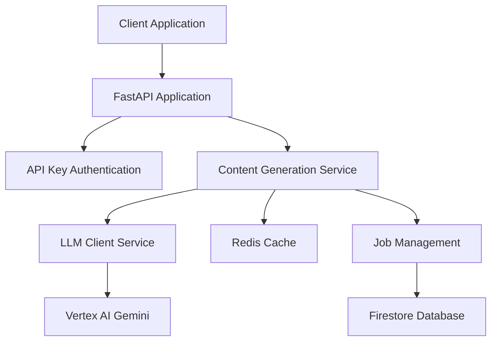

# AI Content Factory

An AI-powered content and podcast factory that transforms textual input (e.g., a topic, syllabus) into comprehensive educational materials including podcast scripts, study guides, summaries, FAQs, flashcards, and more.

## Overview

The AI Content Factory uses Google Cloud Vertex AI (Gemini models) to generate structured, educational content from simple text inputs. The system follows an outline-driven approach where a master content outline is first generated, then used as the foundation for creating various derivative content types in parallel.

## Features

- **Master Content Outline Generation**: Creates structured learning frameworks from input text
- **Multi-Format Content Generation**: Supports podcast scripts, study guides, one-pagers, detailed reading materials, FAQs, flashcards, and reading guide questions
- **Quality Validation**: Comprehensive content quality assessment and iterative refinement
- **Intelligent Caching**: High-quality content caching with TTL and quality-based retention
- **Cost Optimization**: Token limit monitoring and cost tracking for AI API usage
- **Async Processing**: Background job processing for complex content generation tasks

## Architecture



For detailed architecture information, see [docs/architecture-map.md](docs/architecture-map.md).

## API Endpoints

### Health Checks

#### Unprotected Health Check
```bash
GET /healthz
```
Basic service health check (no authentication required).

**Response:**
```json
{
  "status": "healthy",
  "timestamp": "2024-01-15T10:30:00Z"
}
```

#### Protected Health Check
```bash
GET /api/v1/health
Headers: X-API-Key: your-api-key
```
Comprehensive health check including AI service connectivity (requires API key).

**Response:**
```json
{
  "status": "healthy",
  "services": {
    "vertex_ai": "connected",
    "cache": "connected",
    "firestore": "connected"
  },
  "timestamp": "2024-01-15T10:30:00Z"
}
```

### Content Generation

#### Generate Content
```bash
POST /api/v1/content/generate
Headers:
  Content-Type: application/json
  X-API-Key: your-api-key
```

**Request Body:**
```json
{
  "syllabus_text": "Introduction to Machine Learning: supervised learning, unsupervised learning, neural networks, and practical applications using Python.",
  "target_format": "comprehensive",
  "enable_caching": true
}
```

**Response:**
```json
{
  "content": {
    "content_outline": {
      "title": "Introduction to Machine Learning",
      "overview": "Comprehensive guide covering ML fundamentals...",
      "sections": [...]
    },
    "podcast_script": {
      "title": "ML Fundamentals Podcast",
      "introduction": "Welcome to our exploration of machine learning...",
      "main_content": "...",
      "conclusion": "..."
    },
    "study_guide": {
      "title": "Machine Learning Study Guide",
      "overview": "...",
      "key_concepts": [...],
      "detailed_content": "...",
      "summary": "..."
    },
    "faqs": {
      "items": [
        {
          "question": "What is machine learning?",
          "answer": "Machine learning is a subset of artificial intelligence..."
        }
      ]
    }
  },
  "metadata": {
    "generation_time": "45.2s",
    "cache_hit": false,
    "quality_score": 0.87
  }
}
```

#### Target Formats
- `guide`: Study guide only
- `podcast`: Podcast script only
- `one_pager`: One-page summary only
- `comprehensive`: All content types (default)

### Job Management

#### Create Async Job
```bash
POST /api/v1/jobs
Headers:
  Content-Type: application/json
  X-API-Key: your-api-key
```

#### Get Job Status
```bash
GET /api/v1/jobs/{job_id}
Headers: X-API-Key: your-api-key
```

## Getting Started

### Prerequisites

- Python 3.11+
- Google Cloud Project with Vertex AI enabled
- Redis (for caching)
- Firestore (for job persistence)

### Installation

1. **Clone the repository:**
```bash
git clone <repository-url>
cd ai-content-factory
```

2. **Install dependencies:**
```bash
pip install -r requirements.txt
pip install -r requirements-dev.txt  # For development
```

3. **Set up environment variables:**
```bash
cp .env.example .env
# Edit .env with your configuration
```

Required environment variables:
```bash
# Core API Configuration
API_KEY=your-secret-api-key
GCP_PROJECT_ID=your-gcp-project-id
GCP_LOCATION=us-central1

# AI Service Configuration
GEMINI_MODEL_NAME=models/gemini-2.5-flash-preview-05-20

# Required API Keys
ELEVENLABS_API_KEY=your-elevenlabs-key
JWT_SECRET_KEY=your-jwt-secret-key-minimum-32-characters-long

# Frontend Configuration
VITE_API_BASE_URL=http://localhost:8000

# CORS Configuration
CORS_ORIGINS=http://localhost:3000,http://localhost:5173
```

📖 **For a complete list of all configuration options, see [Configuration Guide](docs/CONFIGURATION.md)**

4. **Initialize Google Cloud authentication:**
```bash
gcloud auth application-default login
```

### Local Development

1. **Start the development server:**
```bash
uvicorn app.main:app --reload --host 0.0.0.0 --port 8080
```

2. **Test the API:**
```bash
curl -X GET http://localhost:8080/healthz
```

3. **Test protected endpoint:**
```bash
curl -X GET http://localhost:8080/api/v1/health \
  -H "X-API-Key: your-api-key"
```

### Docker Development

1. **Build the container:**
```bash
docker build -t ai-content-factory .
```

2. **Run with Docker Compose:**
```bash
docker-compose up -d
```

This starts the application with Redis and other dependencies.

## Testing

### Running Tests

**All tests:**
```bash
pytest
```

**Unit tests only:**
```bash
pytest tests/unit/
```

**Integration tests:**
```bash
pytest tests/integration/
```

**With coverage:**
```bash
pytest --cov=app --cov-report=html
```

### Test Configuration

Tests use mocked external services by default. To run integration tests against real services:

```bash
export INTEGRATION_TESTS=true
pytest tests/integration/
```

## Code Quality

### Linting and Formatting

**Format code:**
```bash
black app/ tests/
```

**Check formatting:**
```bash
black --check app/ tests/
```

**Lint code:**
```bash
flake8 app/ tests/
```

**Type checking:**
```bash
mypy app/
```

### Pre-commit Hooks

Install pre-commit hooks to automatically format and lint code:

```bash
pre-commit install
```

This will run `black`, `flake8`, and `mypy` on every commit.

### Development Validation Script

Run all quality checks:

```bash
# Check code quality
black --check app/ tests/
flake8 app/ tests/
mypy app/

# Run tests
pytest

# Check Docker build
docker build --no-cache .
```

## Configuration

### Settings

Application settings are managed through `app/core/config/settings.py` with support for:

- Environment variables
- Google Secret Manager (for production)
- Sensible defaults for development

### Secret Management

**Development:** Use `.env` file or environment variables
**Production:** Secrets automatically loaded from Google Secret Manager

### Caching Configuration

```bash
# Redis Configuration
REDIS_URL=redis://localhost:6379
CACHE_TTL_SECONDS=3600
CACHE_MIN_QUALITY_RETRIEVAL=0.75

# Content caching is conditional based on quality scores
```

### Cost Management

```bash
# Token and cost limits
MAX_TOKENS_PER_CONTENT_TYPE=1000
MAX_COST_PER_REQUEST=0.50
ENABLE_COST_TRACKING=true
```

## Deployment

### Google Cloud Run

The application is designed for deployment on Google Cloud Run with:

- Automatic scaling
- Service-to-service authentication
- Integration with Google Cloud services

See [docs/DEPLOYMENT.md](docs/DEPLOYMENT.md) for detailed deployment instructions.

### Infrastructure as Code

Terraform configurations are available in the `iac/` directory for provisioning:

- Cloud Run services
- Firestore database
- Secret Manager secrets
- IAM roles and policies

## Monitoring

### Health Checks

- `/healthz`: Basic liveness probe
- `/api/v1/health`: Comprehensive readiness probe with dependency checks

### Metrics

The application exposes Prometheus metrics for:

- Request rates and latencies
- AI API call metrics
- Cache hit rates
- Job processing statistics

### Logging

Structured JSON logging with:

- Correlation IDs for request tracing
- Cost tracking for AI API calls
- Quality metrics for generated content
- Performance monitoring

## Contributing

1. **Fork the repository**
2. **Create a feature branch:** `git checkout -b feature/amazing-feature`
3. **Follow coding standards:** Use `black`, `flake8`, and `mypy`
4. **Add tests:** Ensure new functionality is tested
5. **Update documentation:** Update relevant docs and docstrings
6. **Submit a pull request**

See [docs/developer/best_practices.md](docs/developer/best_practices.md) for detailed development guidelines.

## Security

- **API Key Authentication:** All endpoints require valid API keys
- **Input Validation:** Comprehensive request validation with Pydantic
- **Secret Management:** Secure handling of API keys and credentials
- **Rate Limiting:** Configurable request rate limits
- **Network Security:** Internal endpoints isolated from external access

## License

[License information]

## Support

For questions, issues, or contributions:

- **Issues:** Use GitHub Issues for bug reports and feature requests
- **Documentation:** See the `docs/` directory for detailed documentation
- **Architecture:** Review `docs/architecture-map.md` for system design

---

## AI Context Dump & Summary Scripts

This project includes scripts to generate comprehensive context dumps for AI analysis:

- **`scripts/generate_ai_context_dump.py`**: Compiles project files into `ai_context_dump.md`
- **`scripts/generate_ai_context_summary.py`**: Creates high-level summary in `ai_context_summary.md`
- **`scripts/generate_ai_context.py`**: Orchestrates both scripts

### Usage
```bash
python scripts/generate_ai_context.py
```

Generated files are available in the `ai_context/` directory and are automatically updated via CI.
