# AI Content Factory - Architecture Map

## High-Level System Overview

The AI Content Factory is a microservices-based application that transforms textual input into comprehensive educational content using AI. Here's how the main components work together:

```mermaid
graph TB
    User[👤 User/Client] --> Gateway[🚪 API Gateway<br/>Rate Limiting & Auth]
    Gateway --> CloudRun[☁️ Cloud Run<br/>FastAPI Application]

    CloudRun --> API[🔌 API Routes<br/>/api/v1/*]
    API --> Auth[🔐 Authentication<br/>API Key Validation]
    API --> ContentGen[🎯 Content Generation<br/>Orchestration Service]

    ContentGen --> Outline[📋 Outline Service<br/>Master Content Structure]
    ContentGen --> Derivative[🔄 Derivative Service<br/>Parallel Content Generation]
    ContentGen --> Quality[✅ Quality Service<br/>Validation & Refinement]

    Outline --> LLM[🤖 LLM Client Service<br/>Vertex AI Integration]
    Derivative --> LLM
    Quality --> LLM

    LLM --> VertexAI[🔮 Vertex AI<br/>Gemini Models]

    ContentGen --> Cache[💾 Content Cache<br/>Redis Storage]
    ContentGen --> Jobs[📋 Job Management<br/>Cloud Tasks & Firestore]

    Jobs --> Worker[⚙️ Background Worker<br/>/internal/* endpoints]
    Jobs --> Firestore[🗄️ Firestore<br/>Job Persistence]

    Worker --> CloudTasks[📬 Cloud Tasks<br/>Async Job Queue]
```

## Component Descriptions

### User-Facing Layer

**API Gateway (Optional for MVP)**
- Rate limiting and basic authentication
- Traffic management and routing
- Currently bypassed in MVP, API key auth handled in application

**FastAPI Application (Cloud Run)**
- Main application entry point
- RESTful API endpoints under `/api/v1/`
- Health checks and monitoring endpoints
- Internal worker endpoints under `/internal/`

### Core Service Architecture

**Content Generation Orchestration Service**
- Main coordinator for the content generation workflow
- Manages the sequence: Outline → Derivative Content → Quality Validation
- Handles caching decisions and job status updates
- Integrates with all specialized services

**Outline Generation Service**
- Creates the master content outline from user input (syllabus text)
- Uses specialized prompts for structured content planning
- Validates outline completeness and coherence
- Foundation for all derivative content

**Derivative Generation Orchestrator**
- Generates specific content types in parallel (when enabled)
- Supports: Podcast Scripts, Study Guides, One-Pagers, FAQs, Flashcards, etc.
- Each content type has dedicated validation rules
- Handles partial generation failures gracefully

**Quality Validation Service**
- Comprehensive content quality assessment
- Iterative refinement based on quality metrics
- Configurable quality thresholds for caching
- Integration with content enhancement tools

**LLM Client Service**
- Centralized Vertex AI Gemini integration
- Handles prompt optimization and refinement
- Token limit checking and cost tracking
- Retry logic with intelligent prompt adjustments
- Prometheus metrics for monitoring

### Data & Storage Layer

**Content Cache (Redis)**
- High-quality content caching for performance
- TTL-based expiration and LRU eviction
- Conditional caching based on quality scores
- Reduces AI API costs for repeated requests

**Job Management (Firestore + Cloud Tasks)**
- Persistent job tracking and status updates
- Asynchronous processing for long-running operations
- Job history and metadata storage
- Integration with monitoring and alerting

**Background Worker System**
- Internal-only endpoints for job processing
- Triggered by Cloud Tasks for async operations
- Secure service-to-service communication
- Status reporting back to job management

## Content Generation Flow

### Synchronous Flow (Fast Response)
1. **User Request** → API endpoint with content parameters
2. **Authentication** → API key validation
3. **Content Generation** → Direct orchestration service call
4. **Cache Check** → Return cached content if available and high-quality
5. **AI Generation** → Create outline, then derivative content in parallel
6. **Quality Validation** → Assess and potentially refine content
7. **Response** → Return complete content package to user

### Asynchronous Flow (Complex Content)
1. **Job Creation** → Create job record in Firestore
2. **Queue Task** → Submit to Cloud Tasks for background processing
3. **Job Processing** → Worker processes job using same content generation flow
4. **Status Updates** → Periodic updates stored in Firestore
5. **Completion** → Final results stored and user notified

## Key Design Principles

**Modularity**: Each service has a single, well-defined responsibility
**Resilience**: Graceful degradation and comprehensive error handling
**Observability**: Structured logging, metrics, and tracing throughout
**Scalability**: Parallel processing and caching for performance
**Quality**: Multiple validation layers ensure educational content standards
**Cost Optimization**: Token limit monitoring and intelligent caching

## Technology Stack

- **Runtime**: Python 3.11+ with FastAPI
- **AI Platform**: Google Cloud Vertex AI (Gemini models)
- **Storage**: Firestore (jobs), Redis (cache)
- **Compute**: Google Cloud Run (auto-scaling containers)
- **Queue**: Google Cloud Tasks for async processing
- **Monitoring**: Prometheus metrics, structured JSON logging
- **Infrastructure**: Terraform for infrastructure as code

## Security Model

**API Authentication**: API key-based authentication for external endpoints
**Internal Security**: Network-level isolation for `/internal/*` endpoints
**Service Accounts**: Minimal-privilege Google Cloud service accounts
**Secret Management**: Google Secret Manager for sensitive configuration
**Input Validation**: Comprehensive Pydantic model validation
**Error Handling**: Generic error messages with detailed internal logging

This architecture ensures reliable, scalable, and cost-effective generation of high-quality educational content while maintaining security and operational excellence.
