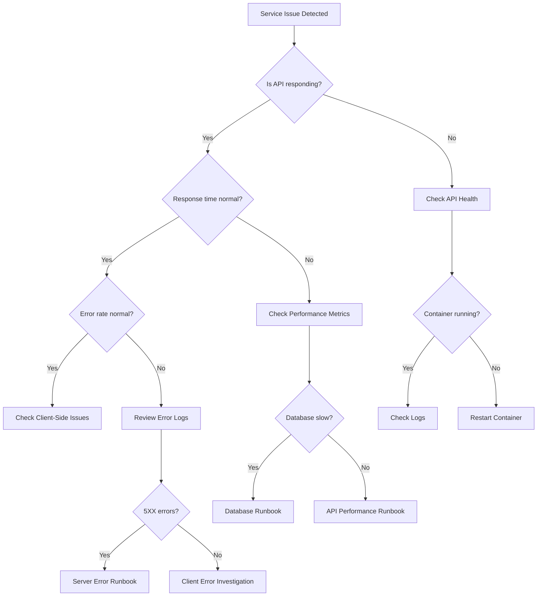

# Decision Tree Template

## [Problem Category] Troubleshooting Decision Tree



## Quick Decision Points

### 1. Service Health Check

```bash
curl -f https://api.lafactoria.com/health || echo "API Down"
```

- **Healthy**: Continue to next check
- **Unhealthy**: Go to [API Down Runbook](../incident-response/api-down.md)

### 2. Error Rate Check

```bash
# Check last 5 minutes error rate
kubectl logs -n production deployment/api --since=5m | grep -c ERROR
```

- **< 10 errors**: Normal operation
- **10-50 errors**: Monitor closely
- **> 50 errors**: Go to [High Error Rate Runbook](../incident-response/high-error-rate.md)

### 3. Performance Check

```bash
# Check response times
curl -w "@curl-format.txt" -o /dev/null -s https://api.lafactoria.com/api/health
```

- **< 200ms**: Excellent
- **200-500ms**: Normal
- **> 500ms**: Go to [Slow Response Runbook](../performance/slow-response.md)

### 4. Database Health

```bash
psql -h $DB_HOST -U $DB_USER -c "SELECT 1" || echo "DB Connection Failed"
```

- **Success**: Database operational
- **Failure**: Go to [Database Connection Runbook](../database/connection-issues.md)

## Escalation Path

1. **L1 Support** (0-15 min)
   - Follow this decision tree
   - Execute basic runbooks
   - Collect initial data

2. **L2 Engineering** (15-30 min)
   - Complex troubleshooting
   - Code-level investigation
   - Infrastructure issues

3. **L3 Senior/Architect** (30+ min)
   - System design issues
   - Multi-service failures
   - Data corruption risks

## Common Patterns

### Pattern 1: Deployment-Related

- Recent deployment? → Check rollback procedure
- Configuration change? → Review changes
- Dependency update? → Check compatibility

### Pattern 2: Time-Based

- Peak hours? → Check scaling
- Scheduled job? → Review cron logs
- Backup running? → Check resource usage

### Pattern 3: External Dependencies

- Third-party API issues? → Check status pages
- CDN problems? → Verify CDN health
- Database issues? → Check connection pool
