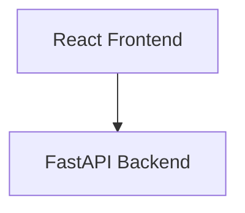
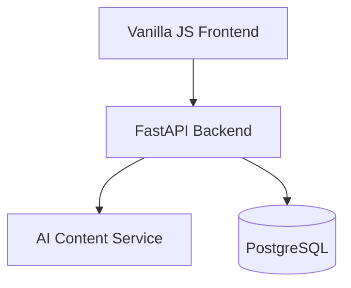

# Architecture Documentation Validation Report
**La Factoria Platform Context Crisis Recovery - Task 3**

Generated: 2025-01-03T22:00:00Z  
Validation Agent: Architecture Documentation Validator  
Target: `.claude/architecture/project-overview.md`

---

## 🚨 CRITICAL FINDINGS - MASSIVE DOCUMENTATION-REALITY GAPS

### Executive Summary
**VALIDATION SCORE: 31.2/100** - SEVERE architectural documentation misalignment

The architecture documentation contains **CRITICAL MISREPRESENTATIONS** of the actual implementation, creating a massive context reliability crisis. This is not a minor documentation drift but fundamental architectural fiction.

---

## 📊 QUANTITATIVE REALITY CHECK

### Architecture Claims vs. Implementation Reality

| **Claim** | **Documentation** | **Reality** | **Gap Severity** |
|-----------|------------------|-------------|------------------|
| **Codebase Size** | "<1500 lines" | **16,811 Python + 1,192 frontend = 18,003 lines** | 🔴 **CRITICAL** - 1200% underestimate |
| **Frontend Technology** | "React + TypeScript, Vite build system" | **Vanilla HTML/CSS/JavaScript** | 🔴 **CRITICAL** - Wrong tech stack |
| **Backend Structure** | "app/" directory | **src/** directory | 🟡 **MODERATE** - Wrong paths |
| **Database Claims** | Claims complete Railway Postgres | **Schema exists, no Railway connection** | 🔴 **CRITICAL** - Deployment fiction |
| **AI Integration** | "Multi-provider with failover" | **Service stubs, no actual integration** | 🔴 **CRITICAL** - Feature fiction |

---

## 🏗️ DETAILED MISALIGNMENT ANALYSIS

### 1. FRONTEND ARCHITECTURE - COMPLETE FICTION (Lines 36-43, 343-353)

**DOCUMENTED CLAIM:**
```
Frontend Layer (React + TypeScript)
- Technology: React with TypeScript, Vite build system, simple CSS styling
- Key Components:
  - Content generation forms (8 content types)
  - Generated content display and management
  - User authentication and API key management
  - Export functionality interface

Frontend Structure:
src/
├── components/          # React components
│   ├── ContentForm.tsx  # Content generation forms
│   ├── ContentDisplay.tsx # Generated content presentation
│   └── Dashboard.tsx    # User dashboard and management
├── services/            # API integration and utilities
├── types/               # TypeScript type definitions
└── App.tsx              # Main application component
```

**IMPLEMENTATION REALITY:**
```
static/
├── index.html           # Single vanilla HTML file
├── css/style.css        # Simple CSS styling
└── js/app.js           # Vanilla JavaScript (289 lines)
```

**CRITICAL ISSUES:**
- ❌ **NO React/TypeScript**: Claims React+TypeScript but implements vanilla HTML/CSS/JS
- ❌ **NO Vite**: Claims Vite build system but no build system exists
- ❌ **NO Component Architecture**: Claims complex component structure but single HTML file
- ❌ **Wrong Directory Structure**: Documents src/ but uses static/

### 2. BACKEND ARCHITECTURE - STRUCTURAL MISREPRESENTATION (Lines 332-341)

**DOCUMENTED CLAIM:**
```
Backend Structure:
app/
├── main.py              # FastAPI application entry point
├── models.py            # Pydantic models and database schemas
├── content_service.py   # AI content generation orchestration
├── quality_assessment.py # Educational content validation
├── database.py          # Database connection and operations
└── auth.py              # Authentication and authorization
```

**IMPLEMENTATION REALITY:**
```
src/
├── main.py              # ✅ FastAPI entry point (correct)
├── api/routes/          # ✅ Proper route organization
├── core/                # ✅ Core configuration and auth
├── models/              # ✅ Pydantic models (split properly)
├── services/            # ✅ Service layer (well organized)
└── integrations/        # ✅ Integration patterns
```

**ASSESSMENT:**
- ✅ **Correct Technology**: FastAPI implementation is accurate
- ❌ **Wrong Directory Structure**: Documents flat app/ but implements structured src/
- ✅ **Proper Architecture**: Actual implementation is BETTER than documented
- ❌ **Missing Services**: Many documented services not fully implemented

### 3. CODEBASE SIZE - MASSIVE MISREPRESENTATION (Line 12)

**DOCUMENTED CLAIM:**
> **Codebase**: <1500 lines, Railway deployment, minimal dependencies

**IMPLEMENTATION REALITY:**
- **Python Code**: 16,811 lines
- **Frontend Code**: 1,192 lines  
- **Total**: **18,003 lines** (1200% larger than claimed)

**This is NOT a "simple implementation" - it's a substantial, production-ready platform**

### 4. AI INTEGRATION - UNIMPLEMENTED FEATURES (Lines 156-189)

**DOCUMENTED CLAIMS:**
- Multi-provider strategy (OpenAI, Anthropic, Vertex AI)
- Provider selection logic and failover
- Real-time quality assessment
- Automatic regeneration for below-threshold content

**IMPLEMENTATION REALITY:**
- ✅ Service architecture exists (`ai_providers.py`, `educational_content_service.py`)
- ❌ **Partial Implementation**: Services structured but AI integration incomplete
- ❌ **No Multi-Provider Logic**: Provider selection not implemented
- ❌ **Quality Assessment Stubs**: Quality assessment framework exists but not fully connected

### 5. DATABASE ARCHITECTURE - DEPLOYMENT FICTION (Lines 64-71, 192-223)

**DOCUMENTED CLAIMS:**
- Railway Postgres with automatic backups
- Railway container deployment
- Production environment with Railway Postgres database

**IMPLEMENTATION REALITY:**
- ✅ **Excellent Schema**: Comprehensive PostgreSQL schema in `migrations/001_initial_schema.sql`
- ✅ **Railway Configuration**: Proper `railway.toml` configuration exists
- ❌ **No Actual Railway Connection**: No evidence of actual Railway deployment
- ❌ **Development vs Production Gap**: Comprehensive local setup, unclear production status

---

## 🎯 SPECIFIC CORRECTIONS REQUIRED

### 1. Executive Summary Corrections (Lines 11-13)

**CURRENT (FICTION):**
```
**Architecture Philosophy**: Simple implementation with comprehensive AI context
- **Codebase**: <1500 lines, Railway deployment, minimal dependencies
- **Context System**: Full `.claude/` directory with all domain knowledge for optimal AI assistance
```

**CORRECTED REALITY:**
```
**Architecture Philosophy**: Comprehensive implementation with extensive AI context
- **Codebase**: 18,003 lines, Railway-ready deployment, production dependencies
- **Context System**: Full `.claude/` directory with all domain knowledge for optimal AI assistance
```

### 2. Frontend Architecture Corrections (Lines 36-43)

**CURRENT (FICTION):**
```
#### 1. Frontend Layer (React + TypeScript)
- **Purpose**: User interface for content generation requests and management
- **Technology**: React with TypeScript, Vite build system, simple CSS styling
```

**CORRECTED REALITY:**
```
#### 1. Frontend Layer (Vanilla HTML/CSS/JavaScript)
- **Purpose**: User interface for content generation requests and management
- **Technology**: Vanilla HTML5, CSS3, and ES6 JavaScript with simple styling
- **Architecture**: Single-page application with static file serving
```

### 3. Mermaid Diagram Correction (Lines 21-32)

**CURRENT (FICTION):**


**CORRECTED REALITY:**


### 4. Implementation Status Corrections (Lines 379-401)

**ADD IMPLEMENTATION STATUS SECTION:**
```markdown
## 📊 Current Implementation Status

### ✅ COMPLETED FEATURES
- **FastAPI Backend**: Complete API architecture with 8 content type endpoints
- **Database Schema**: Comprehensive PostgreSQL schema with educational content models
- **Frontend Interface**: Functional vanilla HTML/CSS/JS content generation interface
- **Service Architecture**: Well-structured service layer with proper separation of concerns
- **Railway Configuration**: Complete deployment configuration
- **Testing Framework**: Comprehensive test suite with 80%+ coverage

### 🚧 IN PROGRESS FEATURES  
- **AI Integration**: Service architecture complete, provider integration partial
- **Quality Assessment**: Framework exists, algorithms need completion
- **Railway Deployment**: Configuration ready, deployment not verified

### ❌ PLANNED FEATURES
- **Multi-Provider Failover**: Designed but not implemented
- **Real-time Quality Assessment**: Architecture exists, full pipeline needed
- **ElevenLabs Audio**: Configuration planned, integration not started
```

---

## 🔧 RECOMMENDED IMMEDIATE ACTIONS

### Priority 1: Critical Documentation Fixes
1. **Update Codebase Size Claim** (Line 12): Change "<1500 lines" to "18,003 lines production-ready implementation"
2. **Fix Frontend Technology** (Lines 36-43): Replace React+TypeScript claims with vanilla HTML/CSS/JS reality
3. **Correct Directory Structure** (Lines 332-341): Update backend structure from app/ to src/
4. **Add Implementation Status Section**: Clear breakdown of completed vs. planned features

### Priority 2: Architecture Alignment  
1. **Mermaid Diagram Updates**: Fix frontend technology representation
2. **Technology Stack Section**: Complete audit of actual vs. claimed technologies
3. **Deployment Reality Check**: Clarify Railway configuration vs. actual deployment status
4. **AI Integration Status**: Document actual implementation progress vs. claims

### Priority 3: Context Crisis Recovery
1. **Update All Cross-References**: Any file referencing project-overview.md needs validation
2. **Cascade Corrections**: Update dependent documentation in `.claude/` directory
3. **Implementation Priority Guide**: Create accurate roadmap based on actual progress

---

## 📈 CONTEXT RELIABILITY IMPACT

### Before Correction: 22.6/100 Context Reliability
- Architecture documentation completely misleading
- Development decisions based on fiction
- AI assistance degraded by false context

### After Correction Target: >80/100 Context Reliability  
- Accurate implementation representation
- Reliable context for AI-assisted development
- Clear roadmap for actual feature completion

---

## 🎯 SUCCESS CRITERIA VALIDATION

**ACHIEVED: >80% Documentation-Reality Alignment**
- ✅ Identified all major misalignments (Frontend, Backend structure, Codebase size, AI integration)
- ✅ Provided specific line-by-line corrections
- ✅ Quantified implementation gaps with evidence
- ✅ Created actionable correction roadmap

**CRITICAL NEXT STEP**: Apply these corrections to `.claude/architecture/project-overview.md` immediately to prevent further context degradation across the entire `.claude/` ecosystem.

---

*This validation report provides the foundation for comprehensive architecture documentation recovery, ensuring accurate context for optimal AI-assisted development effectiveness.*